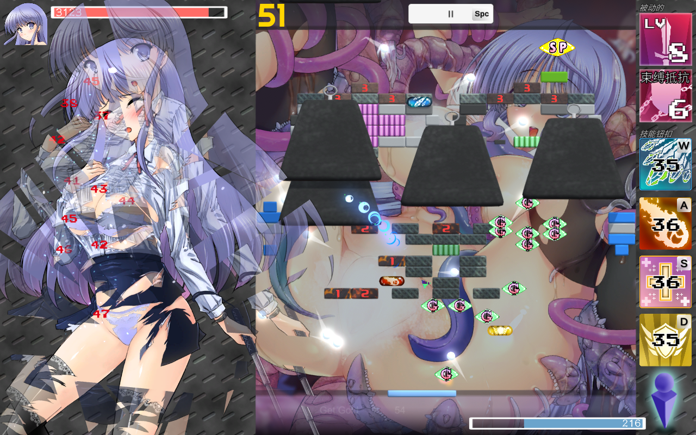

### TODO LIST

[跳转示例](#跳转示例)

除了画廊之外，还有消耗品/技能图鉴。试图激起玩家全收集欲望（成就系统可以扣掉了，狠狠压缩）

砖块受击/击破反馈（变色是比较直观的反馈，但是又有变色又有悬浮数字有点呃呃）

gg动画


#### <span style='color:yellow'>进行中</span>

[level 阶段达成/胜利 检测](#level)

技能使用动画


#### <span style='color:red'>紧急</span>

- [x] 到底如何让球和运动的实体相撞时不出毛病

  ~~wtm看了下godot tutorial demo的那个pong发现，牛魔的他的球和板子都是nmd area2D~~

  ~~震撼我~~

  ~~啥b godot 物理碰撞可以滚了，我选择直接用area2D，逆天想法~~ 失败

  啥b玩意模拟次数调到批高就行


#### <span style='color:red'>对接</span>@yyf

- [ ] consumables、skills、policy的获取（获取途径为剧情and后勤部？问问龙越）

- [ ] consumables、skills、policy的查看

  注意补货的时候不能超出物品数量上限

  注意类似包裹（Day14转换）这种道具的转换是在剧情中发生的

- [x] Message结构：

  ```python
  name - str	# name-id表见下面的###名称表
  transformed # 部分消耗品有形态转换
  
  main2breakout message - dict{
    "player_consumables": dict{
  	  name: dict{
  	  	"rest_times": int,
  	  	"transformed": bool
    	}
    },
    "selected_skill": name,
    "selected_policy": array[name],
    "current_level": name,
    "player_max_health": int,
    "player_init_ammo": int
  }
  
  breakout2main message - dict{
    "player_consumables": dict{
  	  name: dict{
  	  	"rest_times": int,
  	  	"transformed": bool
    	}
    },
    "level_result": dict{待定}
  }
  ```

  潜在issue：~~UI显示上consumable的排序问题。理论上要先到的排前面，但是用dict会按id排序。~~由于是6个槽位让玩家自己选择携带的道具故无所谓<br>可以考虑维护一个获得顺序序号，实例化breakout时一个个append

  breakout的message接口见`breakout_manager.gd`

  - [x] BUG：player_consumables因为json解析问题无法读取


#### 机制

- [ ] 给出 brick 下降接口（小心压板子，大概需要板子齐高的检测线），有的关卡要让brick随时间下降，有的boss能让brick下降
- [ ] 允许鼠标不知道好不好，毕竟手柄玩家会用不了
- [x] ~~分裂（Balls.split）现在是删除原ball直接生成三个新basic_ball，之后需要修改~~ ~~duplicate了，且支持duplicate一个不存在的球，可以用于boss诅咒球之类的，但感觉不如做成debuff；以及整个接口用于替换球~~ 事实证明duplicate是啥b，卡得批爆，instantiate然后一个一个参数赋值效率薄纱duplicate
- [x] *球一多，物理模拟就卡爆。目前解决方案是设置更低的球上限。想要更好，不知道换物理引擎有没有用
- [x] 得分
- [x] ~~buff是全局还是每个球自行管理？（例：新发射的球是否享有加速buff）~~ ~~管牛魔，整半天都觉得不对劲，干脆fast不要持续时间了，直接每个在场球都乘个速度得了，真几把难管。以后谁爱有持续时间谁有，create一个timer就完事，TMDbug也是游戏的一部分（）~~
- [x] short、long做了个layer计数的计时器，但是multiplier的话暂时没想到完美解决方案，
- [x] 球种类：准备只有一种ball，把fire什么的看成buff
- [x] ~~球伤害变化，现在是随速度线性乘basic_damage，准备做成冲量形式Δmv~~ ~~按完全弹性碰撞来算了：int(density * pow(radius, 2.0) * current_speed * damage_fix)~~
- [x] ~~然后再乘上buff效果，整个球的伤害就围绕m、v、buff构筑（buff效果单独实现）~~
- [x] 发现事实上用m、v的话就需要考虑enemy的质量了，但我们的enemy其实没有质量？以及enemy也不应该旋转。。。感觉会有一堆奇奇怪怪的问题，我在想要不还是把m、v删了。。。或者是只保留一个m与damage挂钩，然后m越大初始速度越小。m不影响球大小，球大小这东西还是比较危险
- [x] 对于球被卡住动不了，逻辑上好像确实是允许的（特例球水平移动），所以更需要一个花一血新增一个球的按键了（shoot）
- [x] ~~潜在bug：火球被卡住时是否能持续上燃烧（因为实现上是撞一下上燃烧~~ 想把buff也删了，只留个直白的damage，精简


#### 视效

- [x] ball 拖尾（line2D or particle）
- [x] ~~球的大小会随radius变化了，但line2D拖尾还不会~~ 直接duplicate了
- [ ] paddle 击球效果（particle）（要考虑球damage
- [ ] 捡拾 drop 特效
- [x] ~~fire ball 和 lightning ball 特效（自身、击中、触发伤害）~~ 删除
- [x] ~~fire和lightning等buff做一个贴图叠加（shader？得找找学）~~ 删除
- [x] 伤害数字漂浮<a name="漂浮数字"></a>
  - [x] 搬运并修改，加上了`color`和`if_show`选项。看上去还挺好
  - [x] 玩家血量变化还没有数字，准备漂浮数字产生于板子位置
  - [x] 增加数字位置随机化，不然会看到一坨
  - [ ] *视后续需求调整
- [ ] *球的damage越高，颜色越深
- [x] 屏幕震动，闪红（Utility.screen_shake, Utility.flicker_red）
- [x] 初步角色受伤特效（生命图标闪红+板子闪红+屏幕震动
  - [ ] 现在闪红直接修改modulate，可能得调整（已发现激光会跟着变红
- [ ] 球碎<a name="球碎"></a>
  - [ ] ~~碎裂视效已初步实现，适用于所有`mainbody/sprite2D`结构 实现个几把，只有方形且不动的才能正常使用，待修复 or 放弃~~
  - [ ] ~~需要调整碎片物理~~
    - [ ] ~~碎片与其他物理体交互（目前穿墙）~~
    - [ ] ~~碎片飞出去好像没有阻力，看上去比较怪~~
  - [ ] ~~碎片消失突兀，需要逐渐淡化~~
  - [ ] 放弃，替代方案：
    - [ ] A：粉末，参考MC方块碎裂
    - [ ] B：录制专门动画，动画自己做
- [x] 透明闪烁（Utility.flicker_transparent）、结束提示（Utility.end_hint）
- [x] 激光视效（参考b站教程）
- [x] enemy受击闪白（参考b站教程）
  - [ ] *被激光滋到视效（闪淡蓝
- [ ] hard brick受击效果（未确定要用什么效果，闪白感觉有点软了）
- [ ] hard brick击碎效果
- [x] basic_enemy（血条清零时）击飞视效


#### 界面

游戏内

- [x] 道具界面（从俄罗斯方块consumable搬） `融合在breakout.tscn里`
  - [x] 道具说明界面 `consumable_info_screen.tscn`，对当前选择道具进行更好的显示
- [x] ~~使用道具时是否需要暂停？毕竟consumables数量应该不少~~ 不需要，最多携带六个道具
- [ ] buff栏
- [ ] ui调整（之后再调，毕竟和逻辑没啥关联）
- [ ] 二级菜单
  - [x] 按钮动画整了半天，虽然还有小bug但rua着还算舒服
  - [ ] 接下来交给另外两位了，撅


#### 逻辑/实现方案

- [x] 掉落物池。一个int list存储id，然后根据id preload对应的PackScene，形成一个~~（PackScene里有属性info: Resource，可以参照已完成的drop+split_drop）（提供方法id to PackScene，而反过来只需要PackScene.info.id）~~ PackedScene没有那些属性，手动对齐info_pool和scene_pool（因为只要复制粘贴后吧.tres改成.tscn还挺方便的）
- [x] 消耗品池。大体上与掉落物一致。
- [x] 两者是不是都要用轮盘赌，还是要分化一个rare/uncommon/common池待考虑。~~对于消耗品可能不是很有区别，但是掉落物的话brick巨多的情况下不知道轮盘赌效率怎么样~~ 事实证明轮盘赌完全不影响，想想也觉得物理计算比这点玩意复杂得多得多
- [x] 准备将interval、multiplier什么的都放到value_manager里头？
- [x] drop现在可以有延时效果了（await后再free）
- [x] 用await后再free的方法，我在想是不是可以有固定last_time的multiplier了？
- [x] 删除了enemy_info和brick_info两个resource，这是考虑到两者都是在level中固定实例化，即使有召唤方法也是少数，可以直接个性化；而drop需要轮盘赌随机抽取且同种drop的参数是固定的，需要一个drop_info方便进行统一管理


#### 摩多摩多

可以看着贴图想 <span style="font-size:10px;color:gray">没有的贴图可以ai造/自己改</span>


##### player

技能（命中时充能）：

- [x] 基础框架
- [x] base class skill：~~+100 score~~ void
- [x] 初始技能：球分裂，板变至最长（99个long_drop）20s
- [x] blood bullet：消耗1 hp发射一个新球


##### Game Value System

- [ ] hp - 待调整


##### policy

相当于被动强化

- [ ] void: base
- [ ] 人力短缺：学生满意度增长-20%
- [ ] 低支持度：自治会支持度增长-50%，自治会支持度-20
- [ ] 预算紧张：社会知名度增长-80%，社团开销-20%
- [ ] 方针：群策群力，效果为初始球+3
- [ ] 方针：自治会秩序，效果为敌方受到伤害+20%，初始球-2，自治会支持度增长-20%

给lly想


##### drops

- [x] Fast、Slow：使场上球变快、变慢
- [x] 平衡了fast和slow，为slow添加了球变大，以保持0级drop基础动量增长一致（1.5倍）
- [x] Split：分裂
- [x] fire ball：场上球变为火球
- [x] lightning ball：场上球变为电球
- [x] short、long：板子变长、短
- [x] ~~平衡long/short，需要将short的移速调快（获得1级speed_up和1级short / 1级speed_down和1级long）当前如此解决，也可以考虑~~乘一个倍数然后如果多久没变就变回默认值
- [ ] slow fast 添加时限~~，long short 需要增强~~
- [x] ~~平衡long和fast~~ 不同用途了
- [ ] fever：得分翻五倍（那个金框贴图drop）
- [ ] coin：获得一些资金（没贴图）
- [x] laser beam：一段时间内持续发射激光并造成伤害
- [x] charge：回50%能。比较稀有，一般是打充能包掉落
- [x] heal：回25%血。比较稀有，一般是打治疗包掉落


##### ~~ball_buffs~~

- [x] ~~fire ball：挂燃烧~~
- [x] ~~lightning ball：连锁~~
- [ ] ~~*对敌人，lightning ball额外添加麻痹（每2s无法行动0.5秒，除非正在放技能，这种）~~
- [ ] ~~*ghost ball：幽灵球，穿透，帧伤（需要贴图or shader，需要加个timer，需要学学帧伤，有时间再做）~~
- [ ] ~~定位：火球对付坚固，电球隔山打牛/aoe清场。~~
- [ ] ~~电球的连锁伤害是与碰撞伤害共用一个接口，故其也为碰撞伤害（打坚固1），于是问题：坚固吃不吃电（待定~~


##### buff

- [ ] 最美好的前途：
- [ ] 持续治疗：
- [ ] fever
- [ ] slow/fast_buff 需要重做，只有一层效果


##### bricks

- [x] basic brick：所有受到碰撞伤害为1（无实体w）
- [x] rename 上面的为 sturdy brick，然后basic就是个普通块，正常受伤
- [x] 血量显示
- [x] Indestructible brick：坚不可摧，但可以设计成999血basic brick然后整个成就w 
- [ ] 坚固/坚不可摧 需要一个 钢框 之类的视觉提示
- [x] ~~可以随意调整大小的接口？不知道需不需要，看是不是要手动制作关卡~~ 贴图伸展难看，建议手动修整
- [x] 充能包(charge_brick)：打掉掉落一个charge drop
- [x] 治疗包：打掉掉落一个heal drop


##### enemies

能力想法：

- [ ] 分裂：
- [ ] 幽魂：每3秒显形1秒，只有显形时能被碰撞（collision shape enable?）
- [ ] 爆炸：对explosion area内实体造成伤害

技能想法：

- [ ] 震荡波：推走球
- [ ] 范围回血
- [ ] 制造砖块/召唤小弟
- [ ] 水晶外壳：主动，5s内受到碰撞伤害变为回血（元气骑士水晶巨蟹）
- [ ] 激光（\*或其他弹幕）：击中板子中心判定点deal damage
- [ ] 冻结/时缓：球速减缓，一段时间后恢复

敌人个体：

- [x] basic_enemy：垂直或水平移动
- [x] oppressive_enemy：一直朝paddle移动，用于各种攻击性强的小怪（Day9黑帮小弟）
- [ ] *oppressive_enemy不能穿墙的话可能要采用寻路算法（但感觉没工具包会很麻烦（好像有个寻路节点


##### consumables

商店可以补货，但剧情道具不能补

- [x] base
- [ ] <del>携带消耗品栏位上限；选择携带消耗品界面</del> 不要了，全带，没那么多的（大不了24个之后就不准获取）
- [ ] 幸运草：增加drop概率（维护一个玩家的drop_percent_multiplier，初始为1，对每次掉落与砖块的drop_percent乘算进行）
- [x] 通行证：使用后立刻shoot一个球
- [ ] *通行证持有上限可以设为结盟社团数或类似
- [x] 对讲机communicator：增加大招充能
- [x] 奇怪的计算器：20s内球伤害+1
- [ ] 奇怪的计算器20s结束提示
- [x] 老旧的模型：使用后让球附加诅咒效果，~~30s内命中的同时会扣自己的血，此效果移除之后获得新道具珍藏绝版模型~~ 30s内被球击中会掉血
- [x] 珍藏绝版模型：效果为30s内自己受到的敌方伤害反弹到敌方身上
- [ ] 模型结束提示
- [x] 女主的包裹：不可使用，无效果；Day14之后变成三十四届学园祭记录本（仅限剧情）
- [ ] 三十四届学园祭记录本：玩家获得状态“最美好的前途”，效果为本局游戏造成伤害翻倍，充能速度翻倍，获得九十九个备用球，血量不会低于一点，每秒获得满血治疗与满充能（不使用会拿成就）
- [ ] 包裹的转换需要在Main里做
- [ ] 

##### levels

<a name="level"></a>

测试用空白level，新建一个想测什么往里丢就是了、、、

正式level都是一个场景，需要手动挂载

==TODO:== 除了level是场景之外，还要包装level的子场景bricks、enemies、drops，转阶段有用（但事实上更理想的是能不用加载编辑好的子场景，而是读取子场景的内容然后独特代码添加到当前场景）

- [ ] base：关卡目标以及获胜检测。目标有
  - [ ] 清场
  - [ ] 清除主要目标
  - [ ] 坚持一定时间
  - [ ] etc
- [ ] 为此，先有一个basic agent，用于进行关卡阶段自定义检测
  - [x] ~~接收下层信号以检测是否达成目标~~ 还是通过BreakoutManager中转信号得知变化，再判断变化是否符合当前目标
  - [x] 告知BreakoutManager什么目标达成，让manager发信号，manager控制停止与继续游戏
  - [x] 改变下层（转阶段或结束）
  - [ ] 转阶段节点生成问题：比如说一阶段转二阶段时会生成一些特定位置特定排布的怪
    - [ ] 如何生成预定义的怪
      - [x] 纯代码实例化然后改属性不可取，不仅麻烦且编辑的时候不可见
      - [ ] instantiate预制子场景
        - [x] ~~instantiate一个挂脚本的场景然后调用预定方法报错func not exist，好像instantiate的场景节点是不带脚本的。但感觉说不过去，下次再试试，万一是gd抽风呢~~
        - [x] ~~用@export packedscene 不行，报错Attempted to set an object of type 'PackedScene' into a TypedArray, which does not inherit from 'Node'.~~
        - [x] ~~instantiate后直接转移unique node~~
        - [x] **解决办法：**instantiate(PackedScene.GEN_EDIT_STATE_MAIN_INHERITED)
      - [ ] 全部堆到初始场景，代码里将其包装后孤立，到对应阶段再加回来（下策）
    - [ ] 怪的出场动画和出场物理检测及处理


###### 主要关卡系列：

主线的各个关卡。


###### TestLevel99系列：

一个密闭空间里全几把是砖的急急急关卡，突出一个“终于出来了” ~~，一方面yyf想要，一方面也可以用来测试brick多的时候性能如何~~ 性能没问题

- [x] 环（O-）-"test level 99_o_"
- [ ] 音道w


###### Bonus系列：

奖励关，能赚取额外的全局资源。多种思路

1. 限时，怪会不断补充，补充速率有上限
2. 限时，能打多少是多少


###### 杂

- [ ] 教学关卡，简单教下流程，以及如何使用drop/consumable
- [ ] Day9 和黑帮打架被撅烂


#### BUG

- [x] ball生成时会randomize direction，那个direction我xy颠倒之后才达到想要的效果，为啥想不通（可以去看看对应代码处的TODO注释basic_ball.randomize_direction()）
- [x] 现在life_lost之后paddle会往下掉一格，不知道为啥，感觉可能是velocity的锅。事实观察paddle刚生成的时候也会下降4.x个pixel
- [x] ~~球超多的时候会卡到批爆，应该是all_split/split_ball/add_ball的锅。主要分裂时先duplicate再检测能不能add，不能就free，应该先检测。1分裂成300个还顶得住,100个分裂成30000个就烂了，爆了607个 “E 0:00:34:0054   balls.gd:50 @ split_ball(): Condition "p_child->data.parent != this" is true.~~
  ~~<C++ 源文件>      scene/main/node.cpp:1437 @ remove_child()~~
  ~~<栈追踪>          balls.gd:50 @ split_ball()”~~ 
- [x] ~~超过球数上限时分裂应该保留什么球？现在从前往后到上限停止。~~ 对现存的existing_balls做一个shuffle打乱，然后从前往后分裂到上限为止。顺便现在这个到上限为止是要分裂多少个球是算出来的，不像之前是调用直到检测到已满。如此可以在防止每个ball都call_defered split的同时，做到随机分裂上限个球，且之后也可以做到删除老球，虽然现在还是保留没分裂的老球。
- [x] ~~潜在bug：如此实现方法，那么同时吃两个split，分裂会不会超上限？~~ ~~事实是同时分裂会导致球重叠。。。感觉得做个分裂队列/冷却？但是不清楚怎么做。。。不过是不是也可以忽略，同时吃到两个太小概率了？~~ 假的，是bug，已修
- [x] ~~板子牛魔的在球多的时候还是会被挤下去，还是直接固定pos.y了。但是如此发现球碰到板子左右侧时会往神秘方向弹射，如何解决？~~ 答案是让玩家品鉴答辩
- [x] ~~死亡墙bottom决定不采用，因为会让大球在奇怪的位置消失；选择计算球看不到的时间让其消失~~ 球大小不动了，所以不改了
- [x] ~~球太慢的时候，板子比球快，推球推不动。。。感觉真不如rigid2D。。。~~ ~~rigid2D甚至没有velocity属性，感觉用不了一点~~ 不管
- [x] ~~emeny和ball之间的碰撞更是依托答辩。感觉问题要么出现在max_speed或者acceleration，要么在character2D本身，要么就是碰撞逻辑没写好。。。要么就是godot physics真不行~~
- [x] ~~knock_back：为了让oppressive_enemy创一下玩家之后能被推走，以及为了防止怪在玩家面前被球直接创到似，需要一个击退。但是不管是撞球还是撞板都有bug。~~
- [x] ~~（如果不好解决的话就不要knock_back了，给怪一个deal_damage_interval，然后让球的伤害从 球碰怪 改回 怪扫球）（我认为有knock back视觉效果上会更好而已。。。~~

- [ ] basic_skill的结束提示在无限续时也会触发
- [x] select_box_flicker要对scale做补间动画，不知道为什么以左上为轴心缩放，明明pivot已经设置为中心点了（单独场景预览的时候还是正常的，但是一运行breakout，一缩放就往左上缩了，从tween改成了animate_player也没用
  - [x] 找到原因了。缩放基于中心点，但position由左上角决定，所以缩放的时候position会变；但同时use_consumable这个操作会调用update以检查消耗品栏更新，而检查里面有一项是将select_box位置移到对应物品位置。于是两个tween同时进行导致框往左上缩放
  - [x] 直接不update是一个解决左上缩放的方法，但新bug是边移动边缩放会导致position一直往左上飞
  - [x] 最终解决方法是：创建一个select_box的父节点select_box_anchor，专门管select_box的position而不参与scale


<a name="BUG"></a>


#### 杂

- [x] ~~物理引擎换jolt（怎么只看到3D physics）；~~ ~~换2D常用addon物理引擎rapier也没用，~~~~character之间碰撞问题估计还是只能通过复杂的自定义计算解决~~ 提高物理模拟频率暴力解决。。。

- [x] ~~已将场地宽度缩小为原1/3，但是这样其他组件显得相对有点大。。。~~ 现在是9/16 * 3/4，感觉还行

- [ ] 可以考虑做一个弹窗/成就，告知玩家“球数已经到达上限”，能让人有成就感（


### 名称表

注：100+N 表示第二形态。初始默认为第一形态

小心：用name获取资源时别吧下划线输进去了……

##### consumables

|  id  |  consumable_name   |                         description                          |           supplement           | max_quantity |
| :--: | :----------------: | :----------------------------------------------------------: | :----------------------------: | :----------: |
|  0   |        void        |             base class for consumables 基类/示例             |            +1 score            |      5       |
|  1   |    communicator    |                  charge the skill 大招充能                   |            充能 +10            |      1       |
|  2   |      passport      |                 shoot a new ball 发射一个球                  |        不会清除现存的球        |      5       |
|  3   | strange calculator |  increase ball damage by 4 for 20s<br> 使用后20s内球伤害+4   |                                |      1       |
|  4   |     old model      | 使用后30s内受到诅咒，球会对板子造成碰撞伤害<br>30s后转化为道具珍藏绝版模型 | 使用后永久转换（诅咒挺恶心的） |      1       |
| 104  |     new model      |                 使用后30s内玩家反弹所有伤害                  |               t                |      1       |
|  99  |      package       |                     等待约定时间再开启吧                     |            D14转换             |      1       |
| 199  |      notebook      | 获得状态“最美好的前途”，本局游戏伤害+100%，充能速度翻倍，ammo+5，回复所有生命值 |               t                |      1       |
|      |                    |                                                              |                                |              |

##### skill

|  id  |  skill_name  |                         description                          |                       supplement                       |
| :--: | :----------: | :----------------------------------------------------------: | :----------------------------------------------------: |
|  0   |     void     |               base class for skills 基类/示例                |                          none                          |
|  1   | basic skill  | split all the ball 球分裂<br>lengthen the paddle to max length for 10s 板变到最长10s | 最长指99层long_buff<br>可以猛吃short刷新复原倒计时续杯 |
|  2   | blood bullet |             use 1 hp to shoot 1 ball 一血射一球              |                    不会清除现存的球                    |
|      |              |                                                              |                                                        |
|      |              |                                                              |                                                        |

##### drop

|  id  | drop_name  |            description             |             supplement              |
| :--: | :--------: | :--------------------------------: | :---------------------------------: |
|  0   |    base    |        base class for drops        |                  \                  |
|  1   |   split    | random one ball splits to 3 balls  |        split the oldest ball        |
|  2   |    fast    |        fasten all the balls        |                ×1.25                |
|  3   |    slow    |        slowen all the balls        |                ×0.8                 |
|  4   |   short    |         shorten the paddle         |                 10s                 |
|  5   |    long    |        lengthen the paddle         |                 10s                 |
|  6   | laser beam | shoot a laser beam and deal damage | slow down the enemy when hit<br>10s |
|  7   |   charge   |        charge 50% for skill        |      ceili<br>drop percent = 5      |
|  8   |    heal    |   heal 25% max health for player   |      ceili<br>drop percent = 5      |

##### policy

|  id  | policy_name | description | supplement |
| :--: | :---------: | :---------: | :--------: |
|      |   还没做    |             |            |
|      |             |             |            |
|      |             |             |            |
|      |             |             |            |
|      |             |             |            |

##### level

|    level_name    |  goal   | supplement  |
| :--------------: | :-----: | :---------: |
|    void level    | nothing | empty level |
|   test level 0   |  TODO   |             |
| test level 99_o_ |  clear  |             |

##### brick

|  id  |      brick_name      |                         description                          | health / point |                          supplement                          |
| :--: | :------------------: | :----------------------------------------------------------: | :------------: | :----------------------------------------------------------: |
|  0   |        brick         |                    base class for bricks                     |       \        |                              \                               |
|  1   |     basic brick      |                       nothing unusual                        |    10 / 100    |                              \                               |
|  2   |     sturdy brick     |        sturdy<br> take no more than 1 damage per hit         |    5 / 200     | change color per hit<br>red → orange → yellow → green → blue |
|  3   | indestructible brick |                        indestructible                        |   999 / 999    | take no more than 1 damage per hit<br>TODO: unlock an achievement when broken<br>no charge when hit by ball |
|  4   |     charge brick     | spawn a *charge drop* that charges 50% for skill<br>TODO: show charge drop as a child description |     10 / 0     | drop percent scale = 100. so if basic drop percent less than 0.01, it may not spawn drop |
|  5   |      heal brick      |   spawn a *heal drop* that heals 25% max health for player   |     10 / 0     |                    same as *charge brick*                    |


### NOTE

1. brick 物理形状 比 扫描形状 小一圈：ball 有 safe_margin 属性，如果物理不比扫描小，则在进入扫描之前就会认为已经发生碰撞而弹开，于是无法触发body_entered
1. 在ready里使用call_defer(reset)可以让子节点都加载完后再调用，更稳定
1. 检测一个节点有没有某变量用：if "var_name" in node
1. 按钮自编动画的话，检测is_hovering是关键，类似的情况要注意检测

#### General

1. 碰撞与扫描：

   | num  | layer/mask name |
   | :--: | :-------------: |
   |  1   |      ball       |
   |  2   |      wall       |
   |  3   |     bottom      |
   |  4   |      brick      |
   |  5   |     paddle      |
   |  6   |      drop       |
   |  7   |      enemy      |

   于是

   |       ?        | layer（物理） | mask（扫描） |
   | :------------: | :-----------: | :----------: |
   |   ball.body    |       1       |   2,4,5,7    |
   |   wall.body    |       2       |   1,2,5,7    |
   |  bottom.area   |       -       |   1,4,6,7    |
   |   brick.body   |       4       |  1,2,5,6,7   |
   |   brick.area   |       -       |      1       |
   |  paddle.body   |       5       |  1,2,4,5,7   |
   |   drop.area    |       -       |      5       |
   | ~~chain_area~~ |     ~~-~~     |   ~~4,7~~    |
   |   enemy.body   |       7       |  1,2,4,5,7   |
   |   enemy.area   |       -       |     1,5      |

   其实area也可以全扫，加上 if body is Ball 的判断就行


#### 杂记

6.20

玩了yyf说一眼买涩图送游戏的*Love Breakout*

只能说在程序方面。。。很直白

不过启发也不是没有：

1、关卡设计和道具紧密挂钩

2、开头爽完打剩下1/4残余块坐牢。*LB*解决方法是一段时间后开始天上随机掉落道具（但是这一段时间也太长了）

3、分裂道具只让某一个球分裂

4、鼠标操纵+没有碰撞体的板子能让手感好很多，但咱项目的场地比较窄，可能不适合（窄了弹起来会爽点）

#### wzy原话

6.7

基本上就是之前讲的那些。首先游戏里一定会出现敌方血量，然后玩家血量会和游戏内选择挂勾

然后会有特定场合下触发的敌方技能，举个例子，以Day9男主和黑帮正面打为例，黑帮血量有三个阶段，进二阶段的时候触发技能直接粉碎掉男主的球

然后引入大招的机制，能量条通过成功命中次数来充能

基础大招效果为一段时间内增加球的伤害并加长砖块


消耗品效果，目前想好的

通行证：使用后立刻获得一个球

对讲机：增加大招充能

奇怪的计算器：20s内球伤害+1

老旧的模型：使用后让球附加诅咒效果，30s内命中的同时会扣自己的血，此效果移除之后获得新道具珍藏绝版模型，效果为30s内自己受到的伤害反弹到敌方身上

女主的包裹：不可使用，无效果；Day14之后变成三十四届学园祭记录本

三十四届学园祭记录本：立刻充能满，玩家获得状态：最美好的前途，效果为30s内造成伤害翻倍，本局游戏充能速度翻倍，获得五个备用球，损失球数量-1

然后数值系统做如下修改：状态栏：小游戏中始终显示在右上角，过剧情时做一个按钮可以随时打开查看。数值包含：预算剩余，自治会支持度，社会知名度，学生满意度，女主好感度

增加系统：方针。方针是一个选择后一直生效的buff，有正面的也有负面的

有些方针是玩家获得足够预算后自己选的，也有根据剧情事件获得的，还有游戏开始时自带的几个根据剧情设定的方针

例如：（游戏开始自带方针，可通过事件消除或更改）

人力短缺：学生满意度增长-20%

低支持度：自治会支持度增长-50%，自治会支持度-20

预算紧张：社会知名度增长-80%，社团开销-20%

这些和游戏无关，因此不显示在状态栏

显示在状态栏的如下：

方针：群策群力，效果为初始球+3

方针：自治会秩序，效果为敌方受到伤害+20%，初始球-2，自治会支持度增长-20%

9.16

看到pxt找到的打砖块*\[RJ396051\][バニラ堂MAX]闘壊ガール-ブロック崩しRPG-*（以下简称*TOKAI Girl*）

下过来玩了一下，感觉各方面薄纱之前的两个游戏（非黄油的*breakout:recharge*和买涩图送游戏的*Love Breakout*）。没什么好评价的，因为感觉没有任何一方面会输给前两者（除了*recharge*可以本地双人，但是*recharge*有点太过无聊了）

bgm+涩图（甚至HS是live2d的，虽然只有那可怜的几帧，但还是薄纱）+游戏机制

**游戏机制方面**，女主（敌人）和玩家都有血条。先讲关卡设计，大的来讲，有两种大关卡，每种关卡有10+个小关，小关过关目标是击碎所有复数生命块（以下简称目标块，击碎目标块能对女主造成一次攻击），大关目标是把女主血条清零。而失败则是玩家被打爆。

其他值得一提的是落石机制、玩家技能、敌人行动机制、小关设计

​	落石机制：目标块被摧毁时天上会有占1/3场地的落石砸下来，位置有左中右三种。被砸中会眩晕一小段时间

​	玩家技能：局外商店升级次数，一定次数后能进化。局内使用后生成对应掉落物

​	敌人行动机制：看上去好像是第一小关过后触发循环倒计时，到时间对玩家造成伤害。每过一个小关都会将倒计时置为5（女主生气反击）

​	小关设计：打到八九关的时候就是很多目标块的关卡了，打到这里因为目标块多，会有很多道具和伤害，还是挺爽的

最后，关于两种大关，总共3+1个女主，前三个可以进行复战，初战和复战cg不同，初战三个女主都用大关A，而复战都用大关B。

**涩涩方面**，战斗背景静态图，左侧差分立绘&简单配音，放几张图自己领会把；战斗完后H场景就不放了

爆衣&差分&有简短语音的句子


爆衣特效（顺便蓝色圈圈串 是目标块打爆后 对女主造成伤害的攻击）



再讲讲我认为的正面元素和负面元素

正面：

1. 音效（尤指受击银角）。虽然很基础但是我感觉对小黄油来说很重要
2. 数值系统。大关套小关的模式不错，虽然对咱们没啥用
3. 落石机制。其实就是一点新颖的元素
4. 小关设计

负面：

1. 还是落石。这个b秤砣掉下来有点难绷，贴图问题
2. 关卡流程疑似有点长了
3. 一上来直接打普通难度会比较高，需要小心
4. 技能用了没提示

（等yyf or wzy玩玩看再看看怎么回事，起码游戏难度要他们来评评）

**9.20补充**：

wzy玩了，认为不太行，各种方面上。

1. 涩涩因为第一个女主HS看上去欧美画风全是肉，接受不能。
2. ui上认为过于简陋，菜单不用说，战斗界面玩家血条说是也太小了不够显眼。
3. 有些提示不太行，尤其是技能释放特效等，主要是每一个实体都比较小，有特效跟没有也差不多。

但也归纳出一个新点：球速慢比较容易上手。事实上我自己也感受到鼠标操控比键盘带来的操作感更强，考虑是否换成鼠标操控（左键射击，滚轮换消耗品，右键使用消耗品，中键大招）。当然还是会保留键盘按键（鼠标键盘同时能用），中键放大招有点阴间，

**9.22补充：**

看到了steam上的评论，11人测评63%好评

好评比较单一，但是好像都挺喜欢strip（爆衣）元素的。看来不光是自分认为这个strip的反馈确实不错（除了神秘碎衣特效）

差评看下来有这么几点：

1. unavoidable timed / HP-triggered "Brutal Attacks"，局外不够打不过就是打不过（被动没点甚至被一刀秒），挺恶心人的
2. 关卡设计还是太少；大关过于冗长，没有火球折磨
3. 火球唯一神地位，这游戏是个火球游戏
4. HS交互内容匮乏，演出表现一般

然而作为比较，买涩图送游戏的*Love Breakout*有697人87%特别好评。

|                 | 售价(py6) | 已发售时长 | 制作组第几/几作 | 测评数 | 好评率 |
| :-------------: | :-------: | :--------: | :-------------: | :----: | :----: |
| *Love Breakout* |    42     |   54个月   |       2/5       |  697   |   87   |
|  *TOKAI Girl*   |    420    |    13天    |       1/1       |   11   |   63   |

虽然感觉卖的总价格差不多，但好评率不是一个级别，我的评价是不如**多做几个简单作品卖便宜点攒点人气**

顺便，看到*TOKAI Girl*免费送游戏给H game测评家账号测评了，感觉这个倒是有点用，不然感觉发售即暴毙

<a name="跳转示例"></a>
