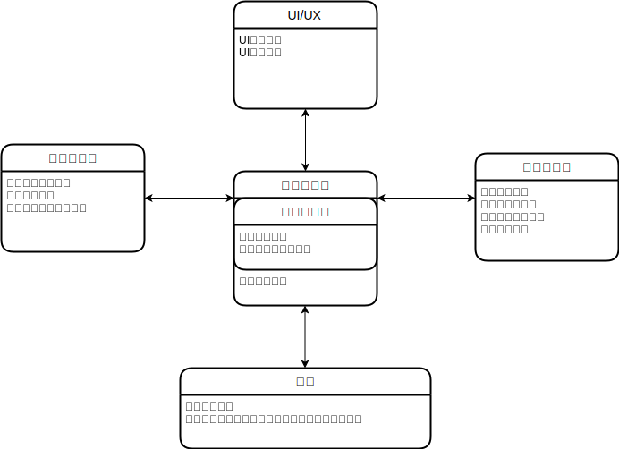

# 关于夏花引擎备选方案及整体架构

- 脚本格式
- 动画格式+实现
- 素材管理
- 程序化音乐生成
- 存档系统
- UI/UX

### Ring Engine(Godot)



| 模块              | 进度                                                         | 备注                                           |
| ----------------- | ------------------------------------------------------------ | ---------------------------------------------- |
| 素材服务器        | 已删除                                                       |                                                |
| UI                | 实现UI统一消息界面                                           |                                                |
| 存档服务器        | 引入LiteDB，已经找到Godot Object序列化方案<br />需求：Version Control | 下一步实现解释器和Canvas的序列化、反序列化函数 |
| Canvas            | 统一背景和角色，使用最基础方案，复杂度转移给解释器           |                                                |
| 解释器            | 框架完成，代码使用moonsharp解释，实现了内置语句Show、ChangBG | 下一步实现各类API                              |
| 动画模块(Effects) | 实现简单接口，实现范例Dissolve                               |                                                |
| psd importer      | 已放弃                                                       |                                                |

### UI

- 开始界面
- 场景界面菜单
- 历史记录
- 存档/读档界面
- 设置界面

### 存档格式

由LiteDB, System.Text.Json, Godot var_to_bytes共同决定

### 脚本格式

````
# 章节标题

```language
codes
# comments
```

show  as 红叶 at farleft with dissolve

changeBG to  with dissolve

角色名："台词"
````

## Stage Management

角色立绘效果：
同屏角色数：3，左中右，用数字命名即可
类似即兴剧的，可以稍微上下左右移动的演出效果
立绘翻转（模拟纸片人转身效果）
出于便利性考虑我希望能直接导入psd文件，不然挺麻烦的

场景特效：
可变文本框位置 - UI
文本出现效果，这个类似其他gal的那种，出现速度/字体调整 - UI + 动画
类似即兴剧的，暗屏/回忆效果/羽化，如果需要美术素材的我来负责 - Shader动画
震动效果（晃屏） - Camera动画
切换场景特效，缺美术素材我来找 - 蒙版动画

系统： - qol
章节切换显示
BGM显示
大chapter结束后回主UI选新标题
画廊/欣赏模式
变UI（通关前后）

素材管理：
一章一章做
背景（bg）全部先由我插入语雀的文段，之后我再把对应的源文件汇总上传到该段落的仓库，采取数字编号（因为实际上没多少，全命名编号太花时间）
立绘如上，希望采用psd编辑
背景音乐同背景，这个更简单，因为更少

脚本格式：
基本台词格式为
角色名+冒号+台词
旁白部分的角色名为旁白
显示效果上，对应章节的主角内心活动不显示角色名

决定好演出的函数调用格式之后（这个我真不知道怎么决定），我再定脚本的细节
