# Chapter ???

changeBGwith dissolve

？？？："那么，世界回应了少女，实现了她的心愿？"

```false
#runtime.InitMiniGame("Breakout")
runtime.Branch("选项1", "选项2")
```

？？："不完全是这样..."

？？："世界以少女的愿望为契机，发生了些许变化，仅此而已。"

？？："真的就只是那...一点点变化。"

？？？："这也...太悲哀了。"

？？："世界本就如此，何来悲哀。"

？？："说到底，哪有什么万能的许愿机啊..."

？？？："那么，人的执念，人的祈愿，就真的一点意义都没有吗"


？？："倒也不能这么说。"

？？："如果要说的话，愿望这种东西大概相当于燃料吧。世界本身的燃料。"

？？："人可能会对它抱有期许，认为它有强大的力量足以改变很多东西。"

？？："然而当他们真的认识到个中含义时，那东西早已被燃尽，灰烬都找不见了。"

changeBG with dissolve

UIAnim fade

:""

## Chapter 1

changeScene 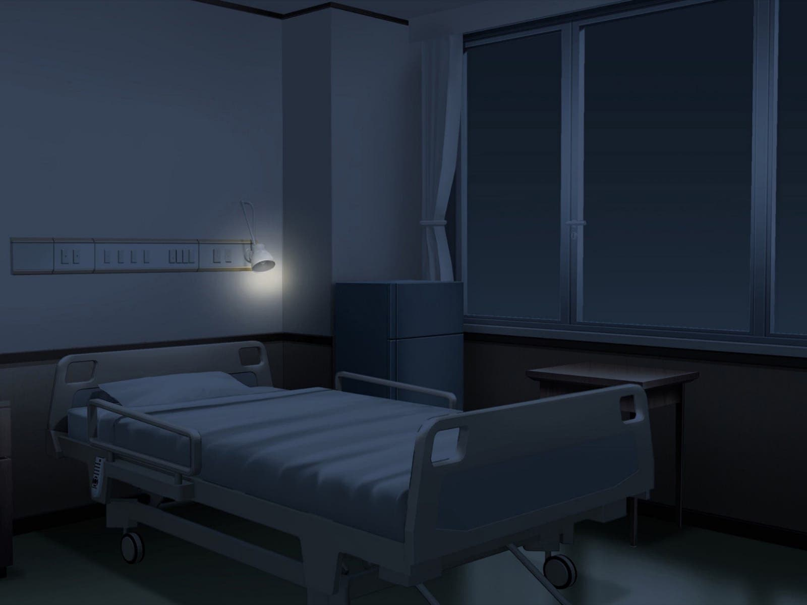with ImageTrans("./assets/Runtime/wink.png")

UIAnim dissolve

？？？："唔…"
？？？："好冷…"
："中央空调正呼呼地吹出冷风。"
："刚刚还在梦中的我突然醒转过来。"
："似乎和往常有些异样，因病痛辗转而又醒来的话，身体是僵硬沉重的，然而现在则非常轻盈。"
？？？："这是我的回光返照了吗...还是..."
："梦里我似乎在一片氤氲着甜蜜花香的树林中漫步，然后听到了谁人在吟诵着诗歌。"

changeScene with ImageTrans("./assets/Runtime/wink.png")

changeBG 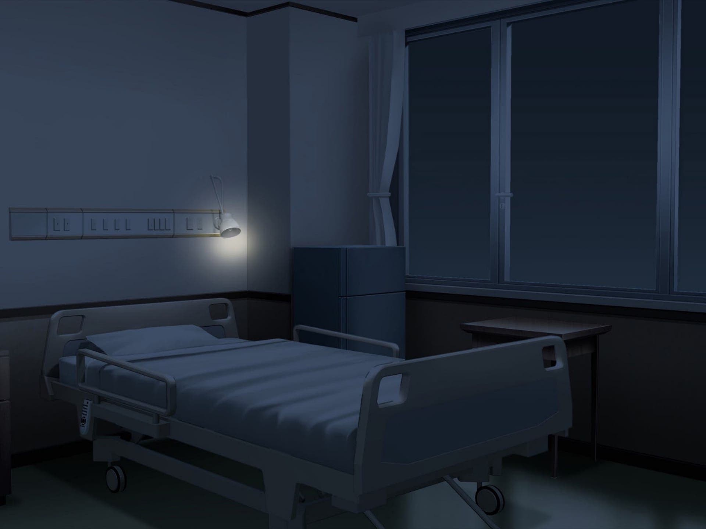 with `dissolve`

？？？："......"
："我尝试活动身体，然而发现四肢无论怎样也使不上劲，只能靠扭动躯体才能勉强坐起来。"
："真是的，明明身体已经到了这种地步，还要让我做这样美丽的梦吗。"
："然而我并不感到悲伤。"
："或者说，早就不会再因为自己这副样子感到悲伤了。"
："但是这个梦让我感到了久违的温暖与充实。只是，醒来的时候，空调的冷风瞬间让我清醒过来。"
："公园的细节仿佛瞬间就从我的脑海中流走了，我也不再能够看清那人的面容。然而那诗歌却仍然留在脑海之中。"
？？？:"“挚爱之人死去之时，我必须杀死自己。挚爱之人死去之时，除此之外，别无他法。”"
？？？："中原中也吗？"
："我望向来看护的母亲。她正趴在床头柜上熟睡着，手边还有一个削到一半的苹果。"
："而我甚至没有气力去为操劳的母亲披一件衣服..."
？？？："真的...非常非常...对不起。"
："鼻子一酸。"

？？？："“即便如此，罪业深重，仍存续此生。”"
？？？："“便怀有一份侍奉的心情，便怀有一份侍奉的心情。”"
："早上就要手术了。这是一场几乎不可能成功的手术。"
："现在医生连我到底得了什么病都不清楚，就要按照“记录中”的治疗方法做手术么。"
："但是即便我反对这样的赌博，母亲仍然坚持这样做。"
："窗帘没有拉，幽幽的月光从窗口洒进来，像是在床上盖了一层银色的毯子。"
："我看向窗外。那里没有常青藤叶。我不禁嘲笑自己的幼稚，怎么会这个时候还在期待某种奇迹呢？"
："不过，如果我这样想，其实也就意味着我仍然期待着某些事情的发生吧"
："在这个时候，我注意到了窗外的异常。"
："不远处的街区，原先一直是正在施工的公园的工地，在一片郁郁葱葱之中，有一棵槐树的叶子变成了白色，像是被雪盖住，又恍如突然开出一树的花。"
："五月份的湖城是不可能下雪的。而槐花的花期在夏末，现在是不会开花的。"

changeBG with dissolve

："这个时候，我听到了...一个故事。"

:" "

UIAnim fade

## Chapter 1-1

UIAnim Dissolve(1.5)

changeBG 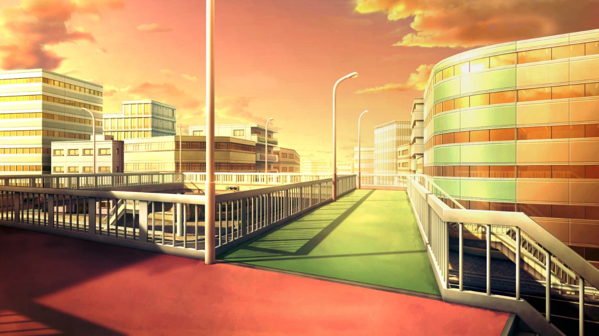with `Dissolve(1.5)`

："寻常的周日，寻常的傍晚，我正走在回学校的路上。"

changeBG with dissolve

："上周刚办好的交通卡帮了大忙，不用再去排队买票了，不然不知道要排队到什么时候。现在想想还挺感谢北风这小灵通的。换作以前的我，由于不太喜欢到处跑，肯定是不会去申请交通卡的。"
："这才三月份，空气却异常闷热，以至于室内都开了空调。"
："但是就算是开着强力的冷气，由于人实在太多，地铁站里仍然热的令人坐立不安。"
羽艾："哎，周末啊…"
："但是，仔细想想，我也大四了，除了毕业论文，已经没有其他的事情了。"
："大概...是这样吧？"

羽艾："就是应该整点大活！"

："..."
："摩肩接踵的人潮中，有很多年轻人，有的也是像我一样的大学生，还有成群结队的中学生。"
："但是和我不一样的是，大多数人都是三三两两结伴而行，有勾肩搭背的好兄弟，更多的是牵着手的情侣。"
："排队过检票闸机的时候，排在我前面的是一对情侣，他们在互相喂着冰激凌。"
羽艾："……"
："怎么我就急匆匆得没想起来买一根冰棍，这天已经这么折磨了，还要被人秀。"

changeScene 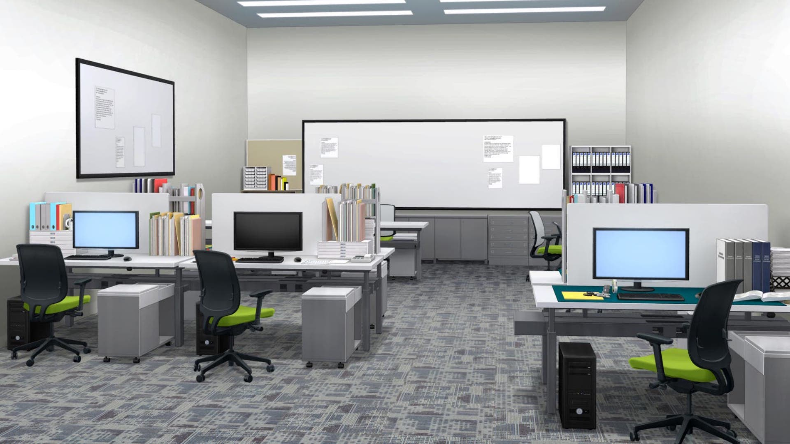with ImageTrans("./assets/Runtime/wink.png")

路汐："啊呀啊呀，这就受不了了吗？"

showas royu at nearmiddle with dissolve


showas royu at nearmiddle with dissolve

路汐："很难想象这样的人是怎么活在满是现充的大学里呢...就像高中生一样。"

showas royu at nearmiddle with dissolve

路汐："啊，不过这也挺可爱的呢，你说是吧，小艾？"

hide royu with dissolve

changeScene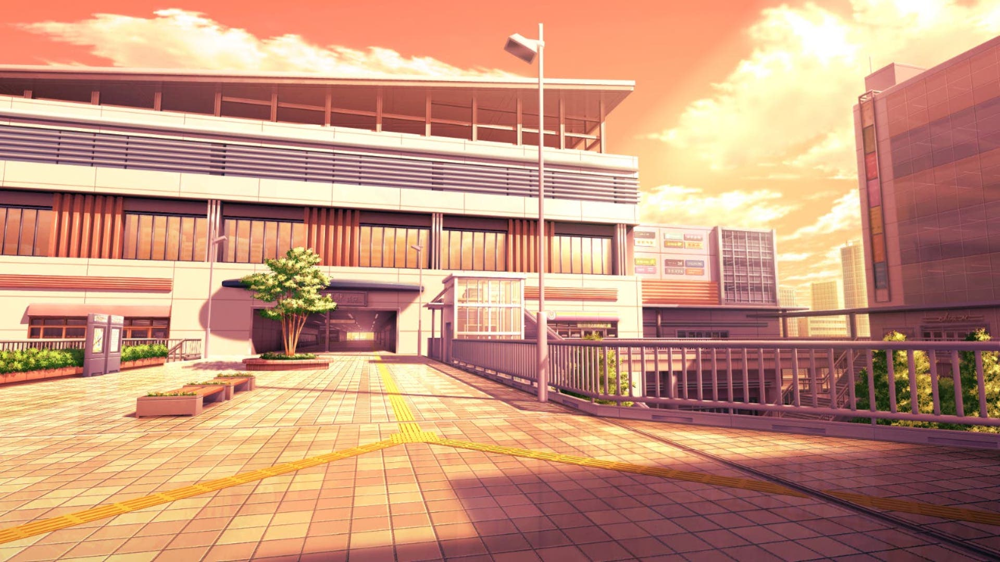 with ImageTrans("./assets/Runtime/wink.png")

："脑海里出现了某人的脸，然后她自动地说着话。"
："如果这副样子被路汐学姐看见的话，一定会被这样嘲笑吧。"
羽艾："啊啊啊啊啊啊啊啊啊啊——"
："受不了了，一拳把地球打爆！"

羽艾："喂！不要插队啊。"
："一个提着皮包的穿着西装男人径直撞开了我，挤在我前面。"
羽艾："..."
："然后我的抗议被轻巧地无视了。"

羽艾："这是周末加班的社畜吧。"
："想到这里，我感觉被插队也没有什么大不了。"
羽艾："好折磨啊。想吃冰棍了。"
："暗暗咽口水。"
："这美妙的周末，我却要跑到市中心一家一家地找公司，投简历。"
："大四生活有很多空闲时间，但我觉得打游戏显然太不够刺激了，因此我要做游戏。"

:"为我枯燥无味一事无成的大学生活添上闪光的一笔，同时说不定还能去参加一下今年的游戏展。"

:"...但是我自己显然没那个本事，所以我在尝试找工作室收我。"

:"然而我又不想去光埋头写代码。做游戏就应该当文案，自己建世界观多浪漫啊。"

："结果是大多数工作室根本就不想理会我一个大四的理科生。有些愿意和我聊聊的工作室，大概是照顾到我是湖城大学的学生，想更礼貌地拒绝。"
："还有几家工作室，他们记下了我的信息，然后只是告诉我说：回去等消息吧。"

羽艾："为什么会变成这样呢，亏湖城自诩为第九艺术中的AVG之城，做galgame的工作室就有几十家，竟然连一个新人都容不下。"

羽艾："就这？"

:"..."

:"罢了，这显得我在无能狂怒，还是乐观点。"

:"...不过之后找工作不会也这么困难吧？"

:"......"

changeBG 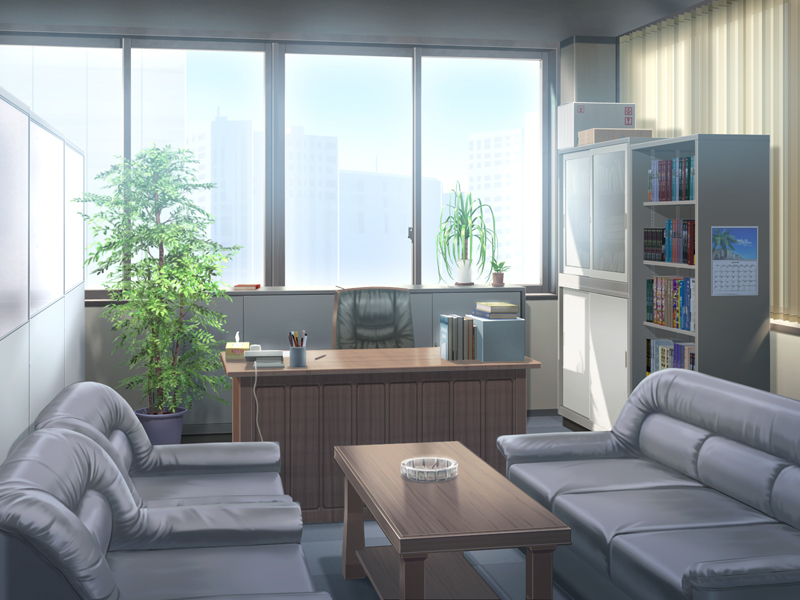with Dissolve(1.5)

staff："先生…同学，你是湖城大…数学系的？"
羽艾："是的，虽然我不是专业的，但是我也有很多作品，您可以看看…"
staff："呃，同学，你为什么会想要写剧本呢，我们印象中，湖城大的理科生，基本都是在埋头搞科研的那种形象…啊哈哈"
羽艾："那都是刻板印象。我对那样的生活并不感兴趣。"
羽艾："我的小说和剧本在中学和大学里都很有市场的。您可以翻看一下..."
："这至少不完全是吹牛。这事由来已久，高中时候我喜欢写点好玩的东西。"
："虽然被家里禁止，也会担心班主任查到，但是大家还是一直这样做。"
 ："我的高中以军事化管理著称，这样不务正业的事情被查到大概是要吃处分的。"
 ："在一帮勤勤恳恳的写手中，我的作品意外地有市场。大概我的同学们，即便是那些看起来最痴迷学习，每天永动机一样内卷的同学，也并不喜欢这种在外人看来值得称赞的紧张气氛吧。"
 ："所以说，创作就是叛逆！"
 ："...但是说到底，我也不知道到底这些小说和剧本算是好还是烂。"
staff："这倒不是说质疑你的能力，只是，湖城大的学习应该很忙吧，也考虑到你的时间..."

staff:"而且想参选江城游戏展的话，湖城大学校内就有名额吧，你为什么不去找社团呢。"

羽艾："呃，这个嘛，我更希望在更成熟的商业工作室里工作。"
staff："...好吧，你的信息我们已经收到了，有通知的话会告知你。"

changeBG 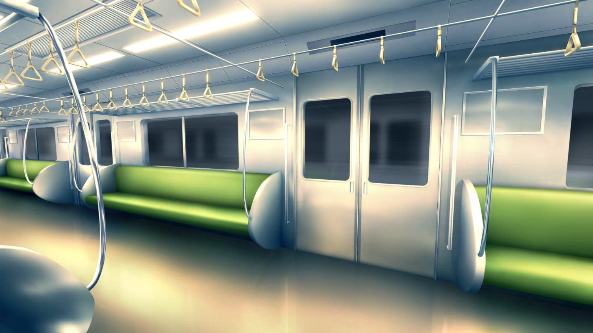with dissolve

羽艾："唉…"
羽艾："就像路汐学姐说的那样，果然还是没人会信任一个没有经验的奇怪理科生。"
 ："走遍了清单上的工作室，收获不能说是对得起时间成本，至少也可以认为是基本没有收获。"
 ："算上网上投递联系的工作室，我已经跑了二十几家，但是至今还没有收到offer，连个回信都没有。"
 ："然后拖着疲惫的身体挤地铁时还要被现充秀。这样一想我更难受了。"
羽艾："他们不会嫌热吗，这破倒霉天气，还要这样贴贴"
 ："我小声地发牢骚。啊，越想越气人了。我不仅要被秀，还不敢大声抱怨。"
 :"打开手机，肌肉记忆般地打开了社交软件，浏览一下消息。"
 ："私信显示一条新消息，是北风发来的。"

北风："你小子润到哪里鬼混去了啊？"
 ："北风是我的室友。计算机系的四年级生，成绩优秀，很有人望，属于大家见面都会叫一声大佬的。"
 ："就他的同学们说，“北风同学平时待人温和，手段多渠道广，又很有翩翩君子的风度，人又帅成绩还好，简直国民老公。”"
 ："我只能笑笑，毕竟他们没和这家伙当室友。"
 ："他私底下可不是这副样子,平时那一副温文尔雅处变不惊的样子都是装的。按照他自己的话说，这叫“张弛有度”。"

 ："呸，臭小子见鬼去吧。"

羽艾："不是老早给你讲了出门找工作室面谈去了吗？"
 ："立刻收到了回信。"
北风："赶紧的，回来，有急事。"
羽艾："啥事啊？"
北风："总之你赶紧回来，到学校小西门，就是靠着菜鸡驿站的那个门联络我。"
羽艾："？？？"
羽艾："所以是啥事啊？"

 ："这回稍微顿了几秒才得到回信。"
北风："你看你，这么热情。那行，走路上菜鸡驿站给我拿个快递呗。"
羽艾："我还以为是什么不得了的事情，你不就几步路？我还在市中心，没空，自己玩去。"
北风："哎呀我电脑跑进程呢，走不开，要是再晚，菜鸡驿站关门就坏了。你给我拿一下呗，明天我请你吃饭行了吧。"
羽艾："哎那行吧，什么快递啊，还有你署名是啥啊，不会又是什么乱七八糟的玩意吧，要是要签字签收我可不干。"
 ："他的快递基本不会写自己的真名，都是拿奇怪的词或者莫名其妙的ID来代替。"
 ："原因嘛，因为他买的那些手办和挂画的盒子过于明显，他就觉得如果用真名，万一被熟人发现，那他平时装出来的那一副dalao的样子就露馅了。"
 ："自然地，每当拿辨识度极高的盒子的时候都是我来代劳取快递，时间长了，感觉菜鸡驿站的工作人员看我的眼神都变了。"
 ："这种活我其实是真的不想干啊..."
 ："大约一分钟之后才收到回复。"
北风："我想想啊。这回应该是叫“M旋风”"
羽艾："这都什么东西。又是手办盒吗？"
北风："这回还真不是，不要污蔑好人，我可不是你这种纯纯二次元。"
羽艾："嘿你这人怎么反咬一口啊！"
 ："……"
 ："…………"
 ："虽然人很多很挤，但是地铁车厢里却很安静，只能听到微小的电视广告的声音。"
 ："我侥幸获得了一个座位，正在车厢壁上的小电视旁边，因此声音也能听的比较清楚。"
 ："听见了旁边的两个中学生样子的男生的交谈。"

男生A："好累啊，明明是周末却还要出来上课…"
男生A："假期的辅导班全部都去死吧！"
男生B："没办法啊，你不卷死别人，别人就要卷死你。"
男生B："想上湖城大，要年级前二十才有机会啊…"
男生A："那这东西就那么重要，非要所有人都去卷吗。"
男生B："…那你想想每年的湖城夏祭，挂着心愿牌的板子上，有多少写的是“被湖城大录取”啊。"
男生A："说的也是。那我也要去向夏之木许愿了。"
男生A："请赐给我神力吧！请赐给我能秒杀一切题目的神力吧！"
男生A："请把我从高中的苦海中救出来吧，我什么都会做的！"
男生B："哦，那讲道理你只需要把你每周和女朋友耳鬓厮磨的时间拿来学习就能做到。"
男生A："那还是算了，感觉不值得。况且要是没有她，我更不乐意学习了。"
羽艾："…"
 ："夏之木是位于夏之木公园的，在湖城的传说中有实现愿望能力的神木。"
 ："每年花节，湖城的人们很多都会到夏之木公园去，许愿并观看灯会。"
 ："传说历史上有数次，有人许愿，然后真的应验了。"
 ："据说夏之木回应人们愿望的标志是开花。"
 ："顺便一提，在几年前建设新校区的时候，夏之木公园被划入了湖城大的版图。"
羽艾："啊哈哈，湖城大学生的日子可不好过啊…"
 ："他们到了大学就会发现，大学也是一样的卷。"
 ："转念一想，似乎每个阶段的学生都在做自己不喜欢的事情，那么这什么时候是个头呢。"
羽艾："管他呢，现在我的目标是江城游戏展！"
 ："就像是仲夏夜之梦中，游离于精灵之森以外的莎翁。"

羽艾:"多么美妙！"

 ："再次回想起地铁上的两个男生。"
 ："高中的时候，哪怕只是有一分钟的自由时间，也要当做珍宝，好好地对待。"
 ："然后到了大学，面对“理论上”更多的自由时间，我却不知所措了。"
羽艾："..."
 ："哈哈哈自作多情什么呢。羽艾啊羽艾，你就是不乐意学习罢了。"
 ："…"
 ："而且，会许愿进入心仪学府的学生可太多了，如果夏之木乐意实现的话，怕是比升学的学生还要忙。"
 羽艾："笑死，那夏之木这工作也太辛苦了，换我绝对不干。"
 ："我抬头望向车厢里的电视屏幕。"
 ："广告切换，随即一段令我非常熟悉的前奏响起来。"
 ："“きっとまた、いつかまた、冬を待って”"
 ："本来有点打瞌睡的我立刻惊醒，望向那个小小的液晶屏："
 ："“…今年的江城游戏展将照常在五月举办…相比去年，今年的参展游戏将增加一倍。人气脚本家SKD会到场举办新作的签售会…”"

 :"号称是史上最大规模的游戏世界观作品征文，在游戏中实现自己的浪漫构想吧。江城玉樱赏基金会会为独立游戏制作者提供支持..."

 ："江城游戏展，全国最大的游戏会展，很多类型的游戏都会参展。"
 ："对于AVG这一小众的圈子，江城游戏展尤为重要，是诸多工作室和同人社团宣传和发布新作、售卖周边以及同人本的重要机会。"
 ："会展最后一天会颁发各领域的年度江城玉樱赏，堪称是游戏界的菲尔兹奖。就算仅仅是被提名，都是无数创作者梦寐以求的。"
 ："自大学以来，我每年都会去看展会。为那些精妙构思惊叹的同时，希望创作属于自己的故事的期望也愈发强烈。"
 ："能参展多好啊，或者更贪婪些，我有没有机会染指那至高的荣誉呢。"

:"但是就现状来看，似乎希望渺茫。"

 ："虽然早已经有了这样的心理准备，但是这样被无情地拒绝，还是多少令人有点沮丧啊。"
羽艾："羽艾啊羽艾，你熬了三年多了，好容易现在大四有时间了，就这么放弃了吗？"
 ："闭上眼睛，我抓着自己的手机，仿佛正手捧一大束鲜花，徜徉于赞美的歌声里。"

 ："手机又响了。"
 ："“新信息”"
路汐："结果如何啊，追梦人？"
 ："..."
 ："怎么这么准时啊..."
 ："不会是特地准时来嘲笑我的吧？"
羽艾："还能如何嘛，仍然没有人理我。嘛，倒也是意料之中了。"
路汐："别灰心嘛，你要是想来实验室坐坐的话，随时都欢迎哦。"
 ："..."
 ："呃呃，这种情况下，去哪里也不会去实验室的吧..."
 ："……"
 ："我取到了北风的快递，从包装看起来像是一个电脑显示屏之类的玩意。"
羽艾："好小子，买了个什么东西，这么沉？"
 ："天色愈发地暗下去，我加快了脚步。"
 ："路过了学校门口的Bafio酒吧。窗子里幽幽地闪着橙黄的光，仅仅是看着就仿佛置身于美妙的木质清香之中."
 ："空调吹散了暑气，冰与苏打洗净了狂躁，身心都松弛下来。"
羽艾："..."
羽艾："还是赶快回去吧。"

:""

changeBG 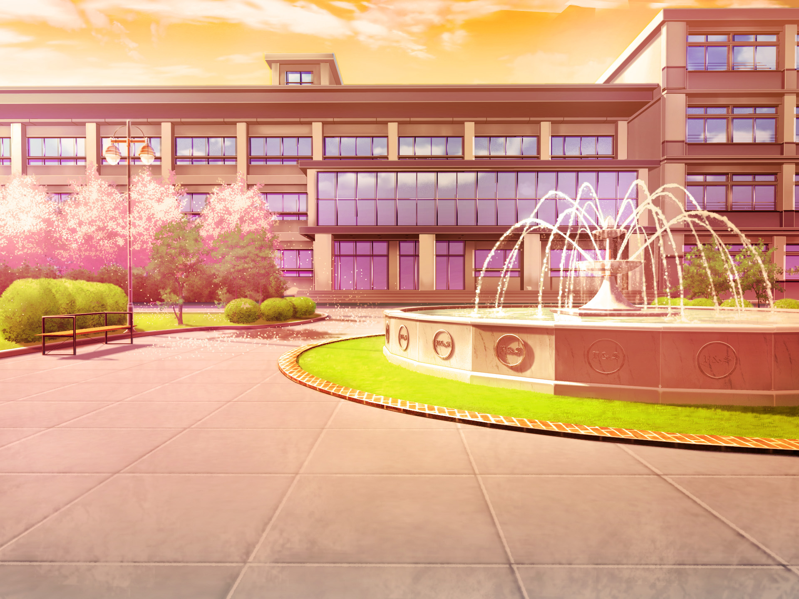with dissolve

 ："靠近宿舍，校园道路的垃圾箱旁，保洁工人正在尝试把桶里的垃圾倒进车子。"
工人："阿嚏——"
 ："桶摇摇晃晃，然后突然掉了下来，吓得我也一个踉跄。里面泼出了许多似乎是方便面的汤水，浇了保洁工人一身。"
 ："不知为什么我突然感觉有些呼吸困难。"
 ："..."
羽艾："你好，需要帮忙吗..."
 ："他转过身看着我，一边费劲地抹着眼睛，一边笑着摇摇头。"
工人："你快过去吧，这里我来收拾。"
羽艾:"..."
 ："此时不禁想，如果要我许一个愿望，大概我会希望世上再也没有向垃圾桶里倒方便面汤的人。"
changeBG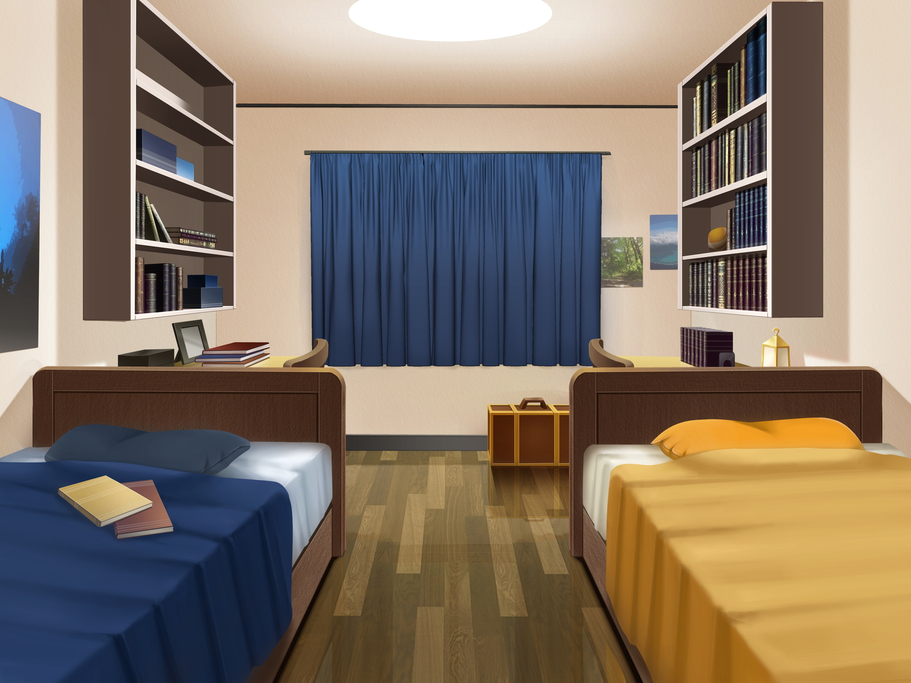with dissolve
 ："我拖着那个沉的要死的箱子挪进宿舍的时候，北风正坐在我的座位上在刷视频。"
羽艾："你小子…这是买了什么大宝贝，怎么这么沉啊？"

show as kitakaze at nearmiddle with dissolve

北风："喔哟，羽艾老板回来了，可等死我了。"
羽艾："你是在等快递吧，和我有什么关系。"

show as kitakaze at nearmiddle

北风："哎，都一样都一样…"
 ："他极为迅捷地拆开了箱子。箱子里是一个巨大的显示屏。"

羽艾："我的天，你整这么大一块屏幕是要做什么…监控室老大爷？"

show as kitakaze at nearmiddle

北风："你懂什么，这是所有CS人都想要的东西。哇，看这大屏幕，看这分辨率…吸溜。"
羽艾："kimo。不知道的还以为是什么二次元耻物。"

showas kitakaze at nearmiddle

北风："你这就是宅眼看人宅。"
羽艾："可是之前每次叫我拿快递，净是去拿一些手办，挂画之类，搞的每次我都要抱着一个大红箱子招摇过市，然后把这玩意毕恭毕敬地塞进您忠实的储藏柜，不是吗？"
 ："我扫了一眼他的储藏柜。虽然是用来装周边，但是并不透明。北风很忌讳被别人得知自己的这种收集爱好。"

show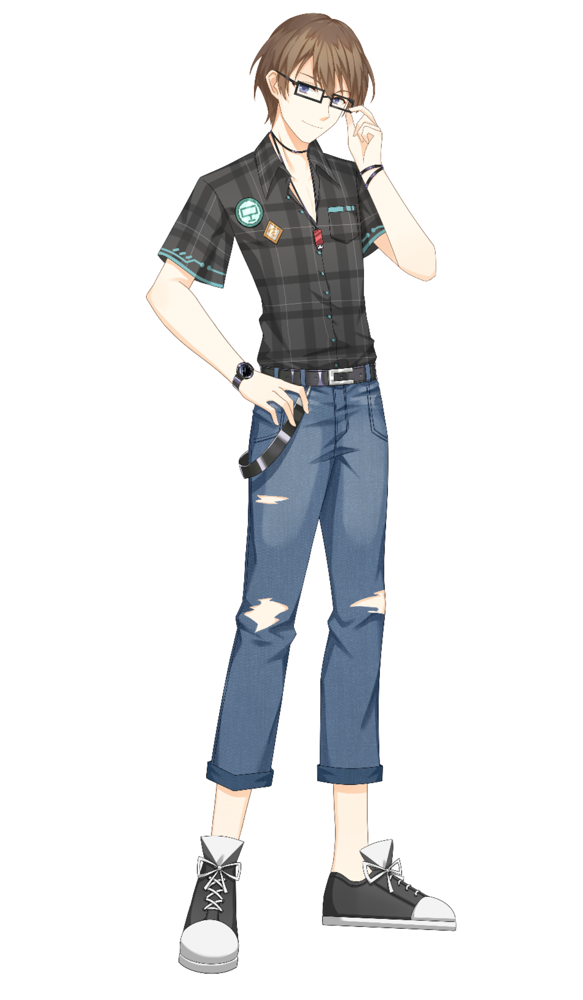as kitakaze at nearmiddle

北风："一点个人爱好而已嘛，你把我想成啥了，除了睡觉就是prpr的死肥宅吗？"
羽艾："那可不敢，北风佬可是人尽皆知的神佬，湖城带学的全校老公。"

showas kitakaze at nearmiddle

北风："你看你这话说的。"
 ："我们都笑起来，只是心绪或许有些微妙的差别。"

showas kitakaze at nearmiddle

北风："说起来，你今天怎么样？"
羽艾："还能怎么样呢，要么直接reject，要么叫我去等虚无缥缈的“通知”。现在我知道投论文是什么感觉了…"

showas kitakaze at nearmiddle

北风："我后来给你的那个列表全都跑过一遍了？"
羽艾："是啊，一无所获。"

show as kitakaze at nearmiddle

北风："厉害啊羽艾，效率很高嘛。"
羽艾："你这话怎么听起来这么像阴阳怪气呢？"

showas kitakaze at nearmiddle

北风："啊，别在意。至少这说明这事有在很踏实地推进，你应该安心才是嘛。"
羽艾："可是这种推进方式也太折磨了吧喂。"

showas kitakaze at nearmiddle

showas kitakaze at nearmiddle

北风："嘛，倒也合理，毕竟做这个可一点都不容易啊…没经验，非专业，甚至连团队都没有呢…"
羽艾："那北风佬能帮帮忙吗？"
 ："我说着打开了电脑，打算确认一下邮箱。"

showas kitakaze at nearmiddle

北风："呃，大二那时候可不就剩我在帮你了嘛。那群家伙，企划启动请吃饭的时候积极的要命，后面说溜就溜了。"
 ："北风耸耸肩。"
羽艾："哎，别提了..."
 ："那是大二的事情了。我尝试召集了十几个“志同道合”的同学，准备着手开始做游戏。"
 ："然而，大多数人只是抱着玩玩的心态，仅仅一个星期，甚至没有等到我把剧本创作完毕，就退出了项目。"

 ："...我检查了邮箱。如预料的那样，连一封新邮件都没有。"
羽艾："哎..."

hide kitakaze with dissolve

 ："这时宿舍的门被敲响了。北风起身去开门。"
学生："啊，你好...请问，那个，北风学长是在这里吗..."

showas kitakaze at nearmiddle with dissolve

北风："你好，幸会，我就是北风，请问有何贵干呢？"
学生："啊，学长好，我是您带助教的数据结构课的同学，想问一下作业情况..."

showas kitakaze at nearmiddle

北风："啊，那个啊..."

hide kitakaze with dissolve

 ："..."
 ："他瞬间转变成了平日里在外面的那种高冷学神的样子，谈吐优雅，文质彬彬。谁能知道仅仅三十秒前这个人还在对着电脑屏幕不可名状呢。"
 ："不过北风也挺忙啊。大概这就是大佬的难处。像我这样的再普通不过的学生，就算是到了大四，也不会有同学特地登门拜访，并亲切地称呼一声“学长”吧。"
 ："这时北风的柜子有些响动。好像是有什么滚了下来。在我回头查看之前，柜门已经绷不住了，满满当当的本子画集还有一些塑料小人滚落了下来。"
 ："我斜眼笑着看向北风的方向，他故作处变不惊的状态继续向学弟解释事情，似乎余光在看我的方向。"
 ："哈哈，耍帅是吧。这下可翻大车咯。我几乎要幸灾乐祸地笑起来。"
 ："这时他回头看向我。"

show as kitakaze at nearleft

北风："...羽艾，把你那一地东西收起来..."

羽艾："我..."
 ："然而我看见了他的眼神。那佯作生气的眼底是要溢出来的恳求。"

hide kitakaze with dissolve 

羽艾："好吧，我的锅。"
 ："于是我半憋着笑，给他把散落的手办一一检查之后放回了原处。幸好都装在盒子里，没有严重的损坏。"
 ："拾掇塑料小人的声音哗啦哗啦，我仿佛听到了某人的心碎。"
 ："..."

 ："送走了学弟，一切恢复了15分钟之前的原貌。北风在座椅上呆了好一会，然后转过来看着我。"

showas kitakaze at nearmiddle

北风："...非常感谢，帮大忙了。"
羽艾："哎没事。毕竟平时我也是干这活的嘛，专门给北风大少爷处理这种尴尬场面。"
羽艾："其实我在想啊，你这些宝贝们，也不是什么不敢摆出来的东西，平心而论我觉得还挺好看的。"

showas kitakaze at nearmiddle

北风："是吧，我的品味可是很独特的。"
羽艾："那你为什么不敢摆出来呢？"
羽艾："人家买塑料小人都是在透明柜子里摆好，你这买来了塞进不透明的柜子，图个啥啊。"

show as kitakaze at nearmiddle

北风："一码归一码，这些并不是不能摆，只是我不想摆。"
羽艾："那你这有啥意义？"

showas kitakaze at nearmiddle

北风："..."

showas kitakaze at nearmiddle

北风："有些东西并不是你想的那样子，本就不是给别人看的。"
羽艾："..."
 ："沉默了几秒钟。"

showas kitakaze at nearmiddle

北风："话说回来，那么你现在打算怎么办呢？"
羽艾："还能怎么办呢，等通知呗。现在我每天就像PTSD一样，看见邮箱有新信息就发了疯一样立刻打开。感觉再这么下去，我迟早要真的疯掉的。"

北风："那你有想过再试一次，自己来做吗？"
羽艾："得了吧，除非万不得已。首先就算加上你，我们缺原画，缺UI设计，缺音乐，缺宣发...总之是什么都缺。至少现在，我绝对不会再相信什么用爱发电这种鬼话了。"

羽艾:"你当时劝我不就这么讲的，大家都有自己的活，有点闲工夫还要自己打游戏呢，哪有功夫陪我搞这些有的没的。"

羽艾:"要在合适的时机，找到合适的人，才能有些许的机会做成这事。"

showas kitakaze at nearmiddle

北风："唉，好吧。倘若有什么需要我帮忙的...尽管提就是了。"

hide kitakaze with dissolve

 ："尽管这人看起来非常不靠谱，但是作为三年的舍友，我深知这话的分量。至少，在大二的那个晚上，当最后一个成员从我身前转身离开的时候，我还记得他的话语。"

changeBG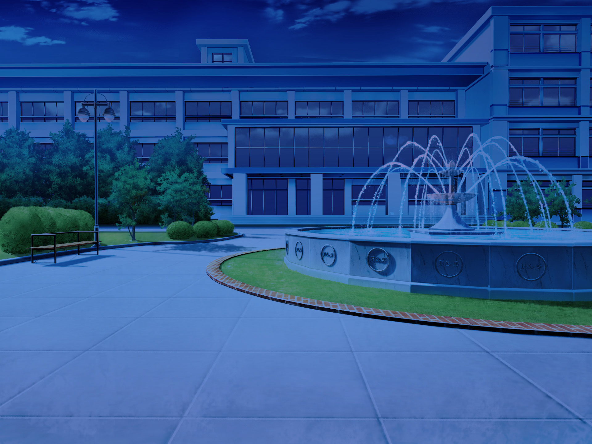with dissolve

羽艾："..."
羽艾："北风你也走吧，我们，哦不，是我，已经彻底失败了。玩砸啦。"
北风："一般来说，好像确实如此。但是..."
 ："说这话时他正站在我身后。"
羽艾："咋地，你难不成觉得就我们俩能搞成？开什么玩笑。"
北风："我怎么觉得，这才刚开始啊。"
羽艾："哈？"
北风："你想放弃？"
羽艾："我不想啊，但是有什么用呢..."
北风："“所谓的作家，正是把一切押在作品上的存在。始终满怀信心，始终强而有力。”"
 ："我抬头看向他。"
羽艾："...又是哪里抄来的大道理？"
北风："哪里听来的不重要，重要的是我让这句话在合适的场合发挥了合适的作用，比如现在。"
北风："况且，这话也不无道理，不是吗？"

changeBGwith dissolve

羽艾："我去趟实验室。"
北风："大周末的，这么晚了，还去卷啊？"
羽艾："废话那么多干什么。"
北风："哦——我懂了，又去找你学姐了对吧。"
羽艾："不耽误北风大少爷团建打游戏。"
北风："还要留着门吗？"
羽艾："...不用了，我自己带钥匙。"
北风："OK，祝你好运。"
 ："..."

changeBGwith Dissolve(2.0)

showas royu at nearmiddle with dissolve

路汐："哦呀，可把我一阵好等呢。没想到这么晚了，还能在教学区域看见羽艾同学的身影呢。"
羽艾："姐啊，就当看在我累了一天的份上，今天就别嘲笑我了吧。"
羽艾："反倒是学姐，又打算在实验室熬夜吗。"

showas royu at nearmiddle 

路汐："这里多棒啊，又没有人会来，全天不断电不断网，不是比那破宿舍强多了。"

路汐："随便坐，今天教授还有你其他师兄都不会来了。"

hide royu with dissolve

 ："我还是回到了我自己的工位，在路汐的正后方。"
 ："她转过来看着我。"

showas royu at nearmiddle with dissolve

路汐："吃过晚饭了吗，正好我刚打算点外卖。"
羽艾："吃过了，谢谢。"
 ："...其实还没吃。"

showas royu at nearmiddle with dissolve

路汐："好吧。"

showas royu at nearmiddle 

路汐："那么，白天斩获如何？"
羽艾："不是之前说过了吗，没有人理我。"
羽艾："到头来，不听老人言，吃亏在眼前了呗。"

show as royu at nearmiddle

路汐："老人言？"
羽艾："啊抱歉！就是说学姐之前告诉我的："
羽艾："‘你一个非科班出身想当主笔，没经验没人脉，成功才有鬼呢。’"

showas royu at nearmiddle 

路汐："哦，现在知道业界险恶是什么意思了吗。"
 ："她仍然是像往常一样的态度，并没有因为我今天遭到了失败就有什么改观。"
 ："嘛，我也早就熟悉了。"

showas royu at nearmiddle 

路汐："但其实我还有一半没有说完。"
羽艾："嗯？请赐教？"

showas royu at nearmiddle 

路汐："其实无论你找什么工作都会这样呢，哟。"
羽艾："喂！有那么夸张吗，好歹也是湖城第一学府，不至于吧。"

show as royu at nearmiddle

路汐："你这样的心态，在湖城大可真是一抓一大把。"
路汐："仿佛现在只要上了大学，出去找工作随随便便都能月入五位数呢。"
羽艾："呃...我也没有这么想啊...这怎么想都是不可能的吧。"

showas royu at nearmiddle 

路汐："但愿你真的不是这样想的。"

羽艾:"但是现在就很麻烦了，如果要参加江城游戏展的话，交预审的日期到今天满打满算也就是45天..."

show as royu at nearmiddle

路汐:"哦呀，你说什么？你不会真的想去参加游戏展吧？"

羽艾:"我没有开玩笑啊，再说了参展又没有什么限制，我去投一下又怎么了..."

showas royu at nearmiddle 

:"学姐似乎想说什么，但又没有说出口。"

羽艾:"我知道很难啊，总名额就那么多，就算真做出来了也很难比得过那些商业作。"

羽艾:"但是...但是无论怎么样我想试一试。"

showas royu at nearmiddle 


路汐："噗。"

路汐:"好吧，我觉得我也没有资格轻易否定别人的想法。"


路汐："羽艾同学，"

show as royu at nearmiddle

路汐："嗯？"
羽艾："不不不没什么。"

showas royu at nearmiddle 

路汐："这种话你早就听腻了吧，我换点新的。"
 ："她正盯着我，用平时很少见的压迫语气说道："

show as royu at nearmiddle

路汐："不管你那游戏最后打算怎么弄，毕设给我认真做。"
路汐："精力是有限的，你早晚要放弃一边。而代价只会越拖越重。"
羽艾："..."
羽艾："明白，我会记得的。"

 ："她换回了平日的语气和神态。"

showas royu at nearmiddle 

路汐："教授那边我已经说好了，我作为学姐直接负责你的论文。马上就要中期检查了，平时可以不来实验室打卡，但是你一定，一定不能忘记了这边的工作。"
羽艾："我保证......我尽力。"

羽艾："那我的事情，学姐会帮忙吗？"

showas royu at nearmiddle with dissolve

路汐："噗。"

路汐："那要看你有没有让我帮忙的能耐了，哟"

showas royu at nearmiddle 

路汐："不过你还真有一个其他人恐怕难以企及的优点，嗯，应该说特点。"

羽艾："呃，是什么？"

showas royu at nearmiddle with dissolve

路汐："纯粹到几乎幼稚的动机，加上恰到好处的自负。"

羽艾："？"

showas royu at nearmiddle 

路汐："好吧。时间不早了，赶紧回去休息吧。"
羽艾："学姐呢，不回去吗？如果需要的话我可以送一下的说..."

show as royu at nearmiddle

路汐："说你不会说话吧，哼。"

showas royu at nearmiddle 

路汐："不用咯，代码还没改完呢。"

showas royu at nearmiddle

路汐："况且，和一个男生一起走夜路总觉得有点怪。"

羽艾："啊呃..."

showas royu at nearmiddle with dissolve

路汐："晚安，好梦。"

hide royu with dissolve

 ："她把转椅转了回去。"

changeBG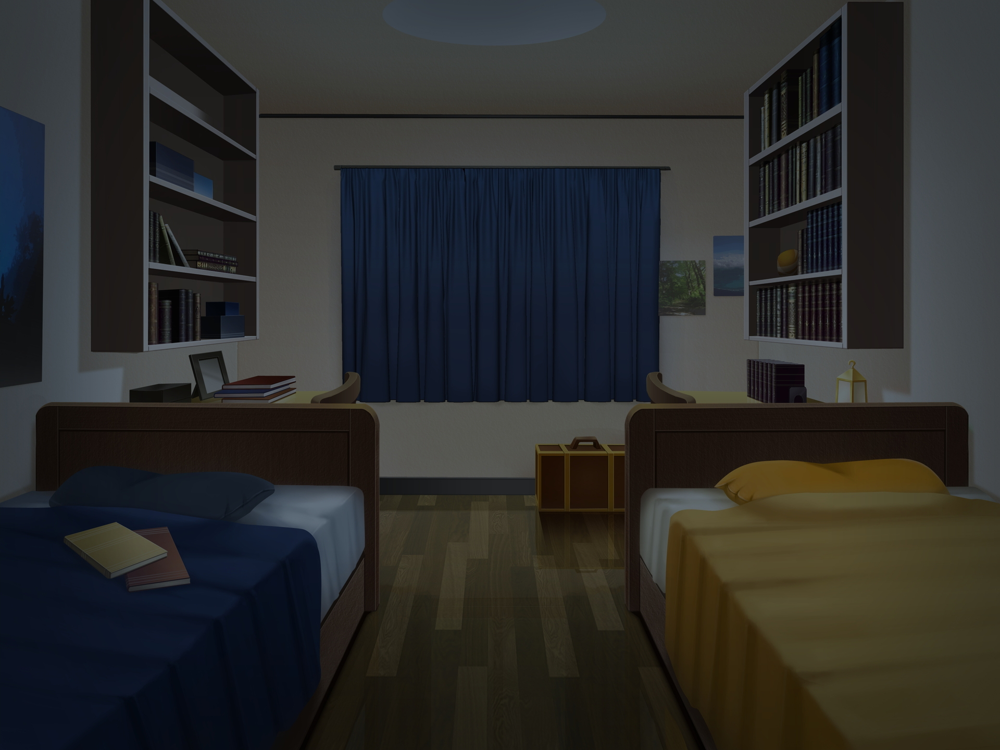with dissolve

 ："..."
 ："躺到床上之后，我再次确认了邮箱。没有回复邮件，只有一些学校官方发的，有关社团与学生活动的广告邮件。"
 ："久违地，我点开了这些平时只会被我丢进垃圾箱的邮件。"
 ："“...支教团...”“...参观xx实验室...”“...xxx学校宣讲...”“...xxx实习...”"
羽艾："无聊。"
 ："我不假思索地诅咒道。"
 ："不，似乎我也不应该这样看别人的生活吧。"
 ："明天的我就不无聊么，"
 ："生活似乎总是一副喝多了的样子，只是游戏里能诗百篇，现实里只能吐一地。"

 ："我呢，没有轰轰烈烈的事业，没有浪漫凄美的爱情，没有等身的著作，没有骄人的成绩，没有嘉奖也没有处分。"

:"如果我写一个自传的话，大概只能写写封面的姓名性别年龄了。"

："白纸有什么意思，所以我注视那个世界。"

 ："纯粹到幼稚的动机么，大概就是这样吧。"
 ：""
 ："..."
 ："......"

changeBG with dissolve

UIAnim fade

:""

UIAnim Dissolve(1.5)

changeBG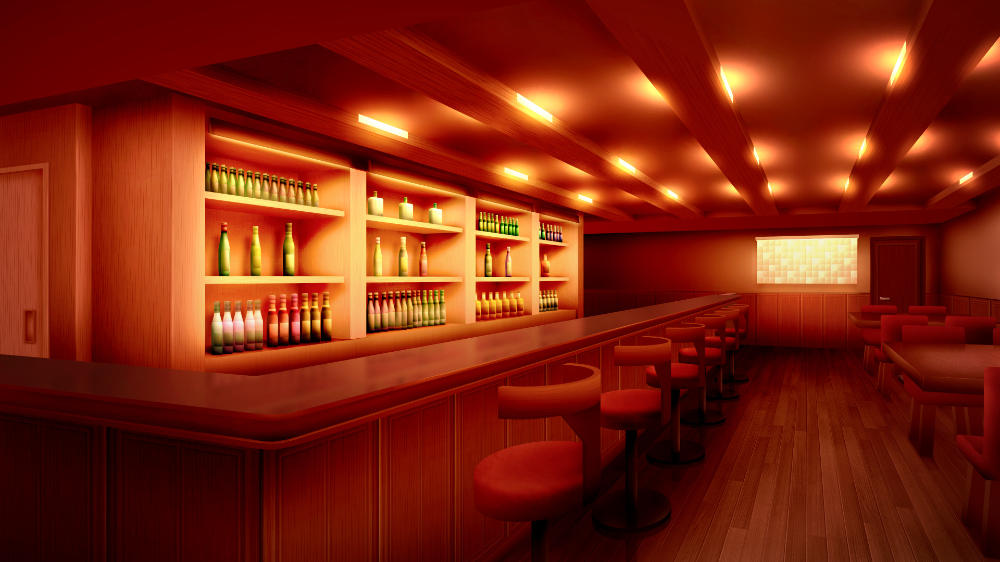with dissolve

："北风为了报答我拯救他于社死命运一事，少见地阔气了一把，请我来这家享誉全校的音乐餐吧吃饭。"
 ："晚上7点，Bafio已经人满为患。我们只能挤在吧台旁边的座位。但是即便如此，这里缱绻的氛围，还是令我流连。"
羽艾："啊，好爽啊。我不想动了。空调啊，我从未感受过，你的气息尚能如此甘美。"

show 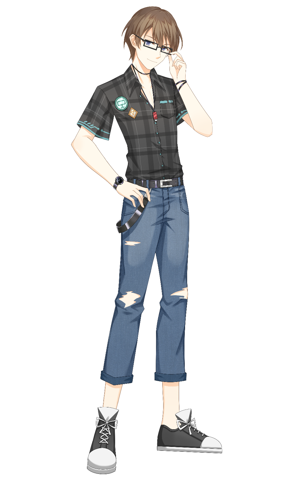as kitakaze at nearmiddle

北风："可不准宰我啊，少点点东西。"
羽艾："那怎么行，好容易来一次，我要把菜单吃个遍。服务员！"

show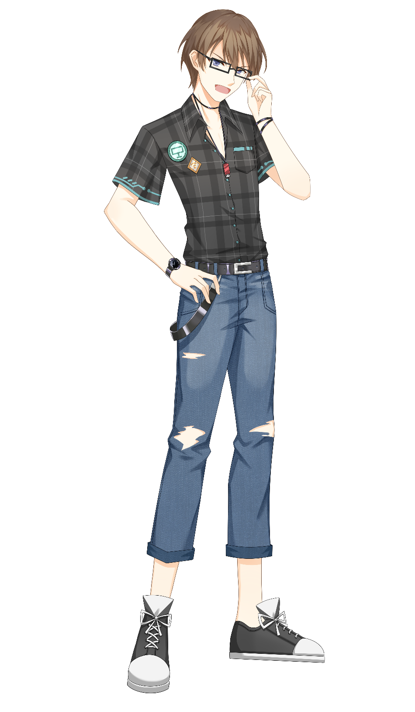as kitakaze at nearmiddle

北风："喂！"

hide kitakaze with dissolve

？？？："您好，请问有什么需要帮助的吗？"
 ："温柔的，令人骨头都软下来的声音。"

showas yulan at nearright

 ："我的目光捕捉到了声音的源头。那正是站在吧台后，身着整齐燕尾服的调酒师。是一位女性，看起来年龄与我们相仿。似乎除了一些口红，没有施用其他妆容，大方而优雅的仪态着实令人着迷。"

茹兰："Bar Bafio的调酒师，茹兰。二位落座已经有一会儿了，是在为点什么发愁吗？"
羽艾："呃，是有点吧。"
 ："其实主要是为价钱发愁..."

showas yulan at nearright

茹兰："请问二位，是第一次来吗？"

showas kitakaze at nearleft

北风："呃，是这样的..."

showas yulan at nearright

茹兰："餐品的话推荐这里的披萨，我个人比较喜欢...虽然热量会很高，但是味道真的很不错，价钱也很便宜！"
羽艾："你作为店员，居然还会考虑顾客的开销吗？"

茹兰："嗯,毕竟我也是来打工的湖城大学生嘛。二位！有兴趣尝尝本店的鸡尾酒吗？"

show as kitakaze at nearleft

北风："欸，好啊，请问有什么推荐的吗？"
羽艾："喂！"
 ："这家伙，看见是美少女调酒师就走不动了吧...但是怎么这人看起来仍然是一脸正经啊。"

showas yulan at nearright

茹兰："嗯...请问二位，对度数有什么要求吗？"
："高度数"
茹兰："那么二位对口味有什么要求吗？"

showas kitakaze at nearleft

北风："辛辣一点的如何？"

showas yulan at nearright

茹兰："“大锤”如何呢？"
羽艾："大锤..."
北风："那就这个吧！"

茹兰："了解了，请稍候哦。"

hide yulan with dissolve

羽艾："北风，你..."

show as kitakaze at nearmiddle

北风："羽艾你要优雅，这种上流的场合，你怎么这么聒噪。"
羽艾："行，行，您上流..."

hide kitakaze with dissolve

 ："我们伸着脖子看着茹兰调酒。"

changeBGwith dissolve
 ："从没见过那样优美的弧线，如玉的十指，月光在其间凝结作附在摇壶外壁的白霜。"
羽艾："喔..."
北风："噢噢噢噢！"
 ："还没等我反应过来，酒杯已经被推到了我们面前。"

changeBGwith dissolve

茹兰："请享用。"
 ："我猛地甩甩头，尝试让自己清醒一点。"

showas kitakaze at nearleft

北风："噢噢噢噢这个好好喝啊！Miss，这真的太优雅了！"

showas yulan at nearright

茹兰："谢谢...您们满意的话，我也会很高兴的。"
 ："茹兰微微鞠躬。"
 ："我慢慢啜饮着杯中的液体。"

羽艾："噗啊——好辣——"

showas kitakaze at nearleft

北风："喂，你这人——"

showas yulan at nearright

茹兰："啊不好意思，没...没事吧？"

hide kitakaze with dissolve

羽艾："没事没事，就是有点低估这杯了。"

羽艾："其实还...挺好喝的？抱歉我不知道怎么描述，就是很直率很坦然的冲击感。"

showas yulan at nearright

茹兰："谢谢，这一杯是伏特加作为基酒的，简单的sour酒体。确实会是很直接的味道呢。"

hide yulan with dissolve

："北风仍然是一脸享受的样子。"

羽艾："说起来，今天是来干嘛的来着..."

show as kitakaze at nearmiddle

北风："呼——"
羽艾："喂，说正事了。"

 ："我狠狠拍了北风的肩膀。"

showas kitakaze at nearmiddle

北风："噢噢噢噢，说正事说正事。是啥来着？"
羽艾："我们的游戏啊...我有想过去学校动漫社捞点人...说起来，学校里AVG爱好者这么多，有没有自己尝试做游戏的啊？"

showas kitakaze at nearmiddle

北风："嗯...这个大概不少，你湖喜欢GAL的可不在少数，据我所知以前动漫社就有好多人试过，但是真做成的十中无一。"

北风："就说计算机系里的人，有不少也有想靠着技术尝试一下的，然后就面临了和我们一样的问题，缺这缺那，要下多少本自己心里也没点估计，问细节都是一团迷糊，一副船到桥头自然直的架势。"

show as kitakaze at nearmiddle

北风："这就搞笑，他们眼睛里看见的是AVG制作的“简单易行”，看不见的是里面的完全不比其他游戏更简便的各种闹心事。动漫社倒是有人想自己拉团队的，然后大多数都像我们那会儿一样，不了了之。"
羽艾："为什么啊，明明他们会更专业一点..."

show as kitakaze at nearmiddle

北风："哪有什么专业不专业，说白了，就是一群爱好者心血来潮玩玩而已。"
北风："湖城大小AVG社团几十上百，最后做出成品的，大都是动机更纯粹一点，天赋更高一点，团队更完善一点，预算更充裕一点，最重要的是，运气更好一点。"

showas kitakaze at nearmiddle

北风："不要说看着这几年业界好像很兴盛的样子，其实早就是强弩之末了。"
羽艾："这是为啥，我看这几年不是新作一年多过一年，几个老IP销量稳定上涨，玉樱赏委员会恨不得多加点名额。"

show as kitakaze at nearmiddle

北风："呵呵，那你一定打过很多，很了解吧？"
羽艾："你别说，我为了我的剧本，参考了很多。还有路...路边看见的报纸推荐的作品，我都打过。"
北风："那么你觉得质量如何呢？"
羽艾："呃......"
羽艾："我说实话，一般。"
羽艾："以我菲薄的经历和肤浅的审美来看，大都是些故步自封的旧套路，人设没新意，剧情无聊。"
羽艾:"技术倒是一年好过一年，但是似乎..."
北风："用金子做的锅炒垃圾吃，对吧？"
羽艾："呃...大概是这个意思。"
 ："北风笑起来。"
北风："但这不过是一个“果”，你想想它的“因”在哪里？"
羽艾："这我哪里知道？"
北风："那我换个问法，你觉得你的创作遇到了什么困难？以及，你为什么这么渴求一个给你发挥的平台？"
羽艾："那还用说，gal是立体的多维度的艺术作品，我不能圈地自萌只停留在剧本上，我需要去拉人和我一起做，人多力量大嘛。"
北风："笑话，你这答非所问，我问的是你遇到了什么困难。"
羽艾："困难......一句话概括就是没人愿意收我，我也拉不到人。"
北风："好，那你觉得只有你一个人这么觉得吗？"
羽艾："呃呃..."
北风："况且，你想一想，你去拉人，你的计划是拉什么人？"
羽艾："那肯定是“志同道合”的，最好亲密一点的人呗。"
北风："问题来了，你拉人，你算哪根葱？想当leader的人多了去了，倘若这么简单就能成事，那玉樱赏怕不是人手有份了。你总得是先有作品，先在市场里有一席之地，才有真正认可你的人来加入你啊。"
羽艾："那怎么办呢，又拉不到人，又要出作品。这不就死循环了吗？何况现在剧本也不好写，好玩有趣的套路早被别人写掉了，新作品往往都是炒冷饭。"
北风："现在你懂为什么业界会是这幅样子了吗？"
北风："就跟你写论文一样，你挠破头想了一个绝妙的idea，然后一搜相关文献发现几十年前就有了。"
北风："你想去加实验室投顶会，但是谁会接受你一个简历一片空白的傻学生。"
羽艾："别骂了别骂了..."
北风："但是，不管用什么办法，倘若真的想要做出成果来，首先要正视这些困难和问题，一味的逃避，或是期待天降大触，只会消磨所有人的热情。"
羽艾："啊..."
 ："血淋淋的现实。所有独立制作者都不得不面临的现实。"
 ："大二的失败历历在目。我暗暗握拳，至少这次，绝对不能再犯这种错误。"
 ："..."
 ："几个学生样子的人走进来，坐在了吧台旁边。他们似乎一直很热切地在讨论着什么。"
A："唉，上学期的课还得补考，这日子咋过啊。"
B："你别说了，我上个学期几乎所有的课都卡绩了，这下本就不富裕的GPA雪上加霜了。"
C："哎呦，我过两天要去实验室面试，PPT还没做完，这可咋整啊。"
A："别说了别说了，我想想这些事情，再想想房价。我算了一下，我就算从清朝开始996干到现在，也买不起房子啊。"
B、C："唉..."

 ："我，北风，茹兰都没有说话，只是静静地看着他们谈论着这些令人很不舒服的问题。"
 ："一个学期18周，15周都像泡脚，温和舒适。"
 ："但是剩下的三周，就会被迫把泡脚水都喝掉。"
 ："..."
羽艾："无聊啊无聊..."
北风："..."
茹兰："..."
羽艾："调酒师小姐，你刚才说你是湖城大的学生？"
 ："我强行结束这令人不悦的沉默。"
茹兰："啊，是的，刚好今年要毕业..."
羽艾："那么你会在这里打工..."
茹兰："一点个人兴趣罢了，您们也看到了，这里的氛围真的很令人舒心，就算...就算谈论一些略微沉重的话题，木材的清香和橙黄的灯光也会让人放松下来。"
 ："确实啊。"
羽艾："不过我为什么有种感觉...感觉只要说起学校，每个人都愁眉苦脸呢。"
北风："你不要乱说，肯定有人每天都很乐呵的。"
茹兰："这要看你是如何看待的了。"
茹兰："假如你把学校的事情看做是头等大事，那么它们自然就是令人喘不过气的压力源。"
茹兰："假如你只是享受其中，并不在意结果，那其实大学生活也还是挺开心的吧。"
茹兰："不过，在这里，很少有后者的情况吧。"
羽艾："..."
 ："感觉，并不是我要关心那些东西的时候。或者说，我从来没有关心过那些东西。"
 ："既然都是上色，那么只要这个故事比他们口中的东西更多彩，我就值得了。"

 ："不过，不管夜晚的梦境多么缤纷，夜晚总还是一片深邃的黑啊。"
