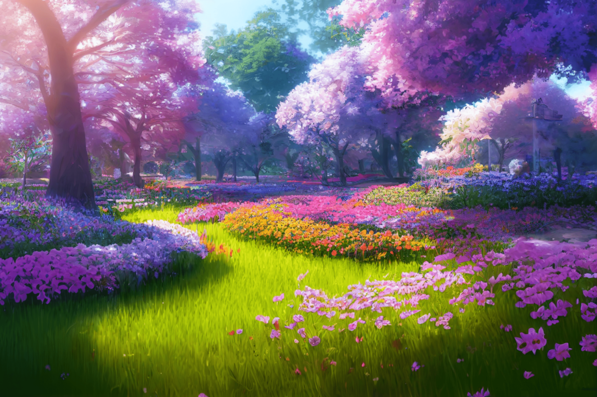

# Chapter ???

changeBG  with `Dissolve(2.0)`

UIAnim fade

UIAnim dissolve

少年："那么，世界回应了少女，实现了她的心愿？"

？？："不完全是这样..."

？？："世界以少女的愿望为契机，发生了些许变化，仅此而已。"

？？："真的只是些许，只有一点点变化哦。"

少年："这也...太悲哀了。"

？？："世界本就如此，何来悲哀。"

？？："说到底，哪有什么万能的许愿机啊..."

少年："那么，人的执念，人的祈愿，就真的一点意义都没有吗"

？？："倒也不能这么说。"

？？："如果要说的话，愿望这种东西大概相当于燃料吧。世界本身的燃料。"

？？："人可能会对它抱有期许，认为它有强大的力量足以改变很多东西。"

？？："然而当他们真的认识到个中含义时，那东西早已被燃尽，灰烬都找不见了。"

？？？："唔…"
？？？："好冷…"
："中央空调正呼呼地吹出冷风。"
旁白："刚刚还在梦中的我突然醒转过来。"
旁白："似乎和往常有些异样，因病痛辗转而又醒来的话，身体是僵硬沉重的，然而现在则非常轻盈。"
？？？："这是我的回光返照了吗...还是..."
旁白："梦里我似乎在一片氤氲着甜蜜花香的树林中漫步，然后听到了谁人在吟诵着诗歌。"

changeBG with `dissolve`

changeBG  with `dissolve`

？？？："......"
旁白："我尝试活动身体，然而发现四肢无论怎样也使不上劲，只能靠扭动躯体才能勉强坐起来。"
旁白："真是的，明明身体已经到了这种地步，还要让我做这样美丽的梦吗。"
旁白："然而我并不感到悲伤。"
旁白："或者说，早就不会再因为自己这副样子感到悲伤了。"
旁白："但是这个梦让我感到了久违的温暖与充实。只是，醒来的时候，空调的冷风瞬间让我清醒过来。"
旁白："公园的细节仿佛瞬间就从我的脑海中流走了，我也不再能够看清那人的面容。然而那诗歌却仍然留在脑海之中。"
？？？:“挚爱之人死去之时，我必须杀死自己。挚爱之人死去之时，除此之外，别无他法。”
？？？："中原中也吗？"
旁白："我望向来看护的母亲。她正趴在床头柜上熟睡着，手边还有一个削到一半的苹果。"
旁白："而我甚至没有气力去为操劳的母亲披一件衣服..."
？？？："真的...非常非常...对不起。"
旁白："鼻子一酸。"

旁白："寻常的周日，寻常的傍晚，我正走在回学校的路上。"

