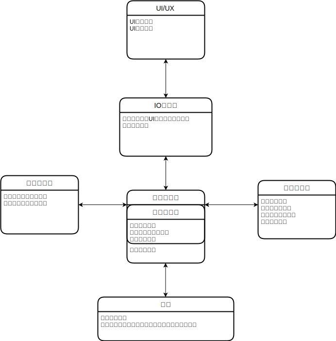

# 关于夏花引擎备选方案及整体架构

- 脚本格式
- 动画格式+实现
- 素材管理
- 程序化音乐生成
- 存档系统
- UI/UX

### Renpy

沿用即兴剧系统，只需要迭代动画库和UI

### Ring Engine(Godot)

| 模块           | 进度                                | 预计工时 | 备注                     |
| -------------- | ----------------------------------- | -------- | ------------------------ |
| 素材服务器     | 基本框架完成                        |          | 之前实现过，可能会快点   |
| 基础运行时对象 |                                     |          |                          |
| UI             | 实现UI统一消息界面                  |          | 可以复用一下jz的工作     |
| 存档服务器     | 基本框架完成                        |          |                          |
| 舞台对象设计   | 基本框架完成                        |          |                          |
| 解释器         | 基本框架完成，regex识别脚本语句完成 |          | multiline code问题待解决 |
|                |                                     |          |                          |

### UI

- 开始界面
- 场景界面菜单
- 历史记录
- 存档/读档界面
- 设置界面

| 格式     | 进度           | 预计工时 | 备注 |
| -------- | -------------- | -------- | ---- |
| 素材索引 |                |          |      |
| 场景     |                |          |      |
| 存档     |                |          |      |
| 脚本     | 格式设计推进中 |          |      |

### 存档格式

对所有可保存点记录一份场景状态和持久化数据状态，前置要求：场景格式

### 脚本格式

- 对话
- 背景图片切换
- 代码块
    - 单个代码块中间不可保存，即代码块标识脚本原子单元
    - 代码块结束处是否默认停止？

TODO：实现各类接口

### Message类型

- InputMessage

| Message Type          | 功能                             | 参数                                     |
| --------------------- | -------------------------------- | ---------------------------------------- |
| ScriptStepForward     | 脚本步进，运行至下一个可保存点   | None                                     |
| SaveToFile            | 保存当前场景到存档               | file_name: String                        |
| LoadFromFile          | 从存档中加载场景                 | file_name: String                        |
| LoadFromHistory       | 从历史记录中加载场景             | step_back: int，距离当前场景回退的step数 |
| UpdatePersistVariable | 更新持久变量（包括设置和进度）值 | var_name: String, new_value: Any         |
|                       |                                  |                                          |

- OutputMessage

| Message Type    | 功能               | 参数                               |
| --------------- | ------------------ | ---------------------------------- |
| PrintToTextbox  | 向文本框中打印内容 | text: String, append: bool = false |
| ShowChapterName | 左上角弹出章节标题 | name: String                       |
| HideUI          | 隐藏UI界面         | None                               |
| ShowUI          | 显示UI界面         | None                               |
|                 |                    |                                    |
|                 |                    |                                    |

