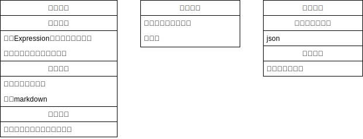

# 关于夏花引擎备选方案及整体架构

- 脚本格式
- 动画格式+实现
- 素材管理
- 程序化音乐生成
- 存档系统
- UI/UX

### Ring Engine(Godot)

| 模块           | 进度                                | 预计工时 | 备注                     |
| -------------- | ----------------------------------- | -------- | ------------------------ |
| 素材服务器     | 基本框架完成                        |          | 之前实现过，可能会快点   |
| 基础运行时对象 |                                     |          |                          |
| UI             | 实现UI统一消息界面                  |          | 可以复用一下jz的工作     |
| 存档服务器     | 基本框架完成                        |          |                          |
| 舞台对象设计   | 基本框架完成                        |          |                          |
| 解释器         | 基本框架完成，regex识别脚本语句完成 |          | multiline code问题待解决 |
|                |                                     |          |                          |

### UI

- 开始界面
- 场景界面菜单
- 历史记录
- 存档/读档界面
- 设置界面

| 格式     | 进度           | 预计工时 | 备注 |
| -------- | -------------- | -------- | ---- |
| 素材索引 |                |          |      |
| 场景     |                |          |      |
| 存档     |                |          |      |
| 脚本     | 格式设计推进中 |          |      |
| 消息     | 格式设计完成   |          |      |

### 存档格式

对所有可保存点记录一份场景状态和持久化数据状态，前置要求：场景格式

### 脚本格式

- 对话
- 背景图片切换
- 代码块
    - 单个代码块中间不可保存，即代码块标识脚本原子单元
    - 代码块结束处是否默认停止？

TODO：实现各类接口

### Message类型

- InputMessage

| Message Type          | 功能                             | 参数                                     |
| --------------------- | -------------------------------- | ---------------------------------------- |
| ScriptStepForward     | 脚本步进，运行至下一个可保存点   | None                                     |
| SaveToFile            | 保存当前场景到存档               | file_name: String                        |
| LoadFromFile          | 从存档中加载场景                 | file_name: String                        |
| LoadFromHistory       | 从历史记录中加载场景             | step_back: int，距离当前场景回退的step数 |
| UpdatePersistVariable | 更新持久变量（包括设置和进度）值 | var_name: String, new_value: Any         |
|                       |                                  |                                          |

- OutputMessage

| Message Type    | 功能               | 参数                               |
| --------------- | ------------------ | ---------------------------------- |
| PrintToTextbox  | 向文本框中打印内容 | text: String, append: bool = false |
| ShowChapterName | 左上角弹出章节标题 | name: String                       |
| HideUI          | 隐藏UI界面         | None                               |
| ShowUI          | 显示UI界面         | None                               |
|                 |                    |                                    |
|                 |                    |                                    |

## Stage Management

角色立绘效果：
同屏角色数：3，左中右，用数字命名即可
类似即兴剧的，可以稍微上下左右移动的演出效果
立绘翻转（模拟纸片人转身效果）
出于便利性考虑我希望能直接导入psd文件，不然挺麻烦的

场景特效：
可变文本框位置
文本出现效果，这个类似其他gal的那种，出现速度/字体调整
类似即兴剧的，暗屏/回忆效果/羽化，如果需要美术素材的我来负责
震动效果（晃屏）
切换场景特效，缺美术素材我来找

系统：
章节切换显示
BGM显示
大chapter结束后回主UI选新标题
画廊/欣赏模式
变UI（通关前后）

素材管理：
一章一章做
背景（bg）全部先由我插入语雀的文段，之后我再把对应的源文件汇总上传到该段落的仓库，采取数字编号（因为实际上没多少，全命名编号太花时间）
立绘如上，希望采用psd编辑
背景音乐同背景，这个更简单，因为更少

脚本格式：
基本台词格式为
角色名+冒号+台词
旁白部分的角色名为旁白
显示效果上，对应章节的主角内心活动不显示角色名

决定好演出的函数调用格式之后（这个我真不知道怎么决定），我再定脚本的细节
